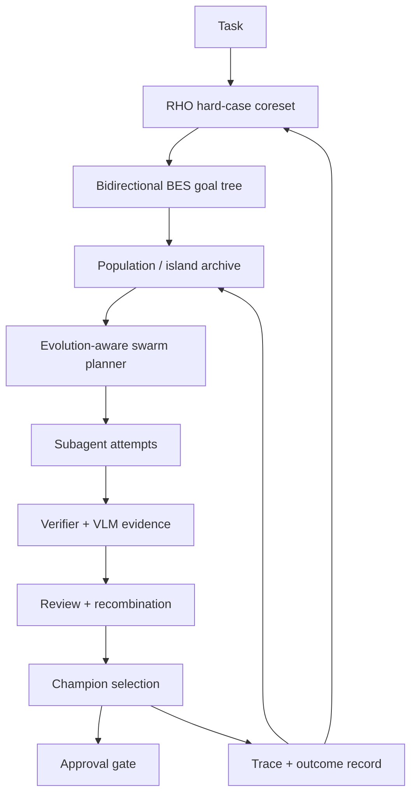

# Swarm Evolution Integration Plan

This document captures the current swarm audit and the plan for making Helios Forge's swarm directly use the evolutionary meta-harness. The short version: the swarm is already a useful attempt/review/champion system, and the meta harness already runs BES/RHO/population evolution, but the two are not yet fused into a single evolution-driven agent team.

## Current State

The swarm layer currently supports:

- seeded and ToolTree-planned attempt scheduling
- deterministic fallback attempts
- model-driven attempts through an injected model gateway or provider
- command/worktree attempts with verifier execution in the same worktree
- per-attempt failure isolation
- reviewer scoring and risk checks
- recombination of approved partial outputs
- champion selection
- approval-gated champion apply
- UI-visible subagent start and completion events

Primary code:

- `src/harness-sidecar/swarm/attemptScheduler.js`
- `src/harness-sidecar/swarm/swarmOrchestrator.js`
- `src/harness-sidecar/swarm/modelDrivenWorker.js`
- `src/harness-sidecar/swarm/worktreeAttemptRunner.js`
- `src/harness-sidecar/swarm/reviewer.js`
- `src/harness-sidecar/swarm/recombiner.js`
- `src/harness-sidecar/swarm/championSelector.js`
- `src/harness-sidecar/swarm/championApply.js`

Relevant tests:

- `tests/harness-swarm.test.js`
- `tests/harness-swarm-runtime.test.js`
- `tests/harness-swarm-model-worker.test.js`
- `tests/harness-swarm-apply.test.js`

Fresh audit verification on 2026-06-08:

```powershell
npm test -- tests/harness-swarm.test.js tests/harness-swarm-runtime.test.js tests/harness-swarm-model-worker.test.js tests/harness-swarm-apply.test.js
```

Result: 29 tests passed, 0 failed.

## Current Limitation

The runtime already runs bidirectional BES, RHO coreset selection, population evolution, and meta optimization before the swarm. The result is stored in task state as `bidirectionalBes` and `evolutionArchive`, and related events are emitted.

However, the swarm does not yet use that evolutionary output as its own planning spine. Today, swarm planning still comes from seeded strategies and a local ToolTree planner. The swarm benefits indirectly from shared context, traces, verifiers, and runtime evidence, but it does not yet:

- spawn attempts from evolved strategy genomes
- allocate attempts based on evolutionary fitness
- preserve island/population diversity across subagents
- route visual tasks to VLM-specialist attempts based on evolved evidence
- feed swarm outcomes back into the evolutionary archive as first-class training signal
- adaptively choose wider versus deeper search based on BES/RHO feedback

## Target Architecture

The target is an evolution-aware swarm loop:



In this shape, BES/RHO/evolution does not replace the swarm. It becomes the scheduler and learning signal behind the swarm.

## Upgrade Plan

### Wave 1: Evolution-Aware Swarm Scheduling

Add a planner adapter that converts BES/evolution archive entries into swarm attempts.

Required behavior:

- Accept `bidirectionalBes.frontier`, `evolutionArchive.archive`, RHO coreset metadata, and task context.
- Produce attempt records with `strategy`, `budgetWeight`, `lineage`, `goalScore`, `islandId`, and `specialization`.
- Preserve current seeded and ToolTree fallback behavior.
- Prefer high-fitness candidates while keeping diversity across islands and missing goals.
- Emit planning metadata so the UI can explain why an attempt was spawned.

Likely files:

- `src/harness-sidecar/swarm/evolutionSwarmPlanner.js`
- `src/harness-sidecar/swarm/attemptScheduler.js`
- `src/harness-sidecar/server.js`
- `tests/harness-swarm-evolution-planner.test.js`

### Wave 2: Budget Allocation From Fitness

Use evolutionary scores to allocate compute.

Required behavior:

- Give more budget to candidates with high dense goal score and strong verifier evidence.
- Reserve some budget for novelty, failed-but-informative branches, and visual/VLM cases.
- Downshift expensive branches when budget gates are near limits.
- Surface per-attempt budget rationale.

Likely files:

- `src/harness-sidecar/swarm/evolutionBudgetAllocator.js`
- `src/harness-sidecar/budget/costAwareAllocator.js`
- `tests/harness-swarm-evolution-budget.test.js`

### Wave 3: Parallel Ask/Tell Swarm Execution

Make swarm execution truly concurrent while preserving deterministic auditability.

Required behavior:

- Replace the sequential attempt loop with a bounded concurrency executor.
- Emit `swarm.subagent_started` immediately for admitted attempts.
- Allow attempts to finish out of order.
- Preserve deterministic result ordering in final summaries.
- Stop or downshift when budget, context pressure, or repeated failures require it.
- Keep one-attempt failure isolation.

This is also the right integration point for a TreeQuest-style ask/tell scheduler.

Likely files:

- `src/harness-sidecar/swarm/swarmExecutor.js`
- `src/harness-sidecar/swarm/swarmOrchestrator.js`
- `src/harness-sidecar/bes/adaptiveSearchScheduler.js`
- `tests/harness-swarm-parallel-executor.test.js`

### Wave 4: Named Agent Profiles

Turn swarm roles into explicit agent profiles.

Required behavior:

- Support profiles such as `implementer`, `reviewer`, `recombiner`, `visual-specialist`, `test-specialist`, `risk-auditor`, and `researcher`.
- Attach model profile, tool caps, memory scope, worktree requirement, VLM access, and output contract to each profile.
- Let the evolution planner choose profiles based on task and goal tree.
- Keep dangerous tool access deny-by-default.

Likely files:

- `src/harness-sidecar/swarm/agentProfiles.js`
- `src/harness-sidecar/swarm/rolePrompts.js`
- `.harness/agent-profiles.json`
- `tests/harness-swarm-agent-profiles.test.js`

### Wave 5: Swarm Outcome Feedback Into Meta Evolution

Make swarm runs train the harness.

Required behavior:

- Record attempt-level outcomes as structured trace evidence.
- Feed champion, rejected attempts, verifier failures, visual failures, and recombination wins into RHO coreset selection.
- Archive high-value swarm strategies as meta candidates.
- Penalize strategies that repeatedly produce unsafe patches, missing verifier evidence, or flaky visual results.
- Keep promotion approval-gated.

Likely files:

- `src/harness-sidecar/swarm/swarmOutcomeRecorder.js`
- `src/harness-sidecar/rho/coresetBuilder.js`
- `src/harness-sidecar/meta/besMetaOptimizer.js`
- `tests/harness-swarm-meta-feedback.test.js`

### Wave 6: Worktree-First Champion Campaigns

Move serious mutation attempts toward isolated branches by default.

Required behavior:

- For coding tasks, prefer worktree attempts when the workspace is a git repo and safe apply is enabled.
- Keep dry-run/model-only mode for low-risk planning or missing adapters.
- Track branch names, patch stats, verifier evidence, and cleanup state.
- Compare multiple worktree champions with merge/conflict risk included in champion score.

Likely files:

- `src/harness-sidecar/swarm/worktreeManager.js`
- `src/harness-sidecar/swarm/worktreeAttemptRunner.js`
- `src/harness-sidecar/collaboration/mergeManager.js`
- `tests/harness-swarm-worktree-campaign.test.js`

## Safety Rules

Evolution-aware swarm must not create a self-approval loophole.

Hard human gates should remain for:

- branch mutation into durable branches
- external network expansion
- secret-bearing config writes
- MCP write-scope expansion
- verifier safety weakening
- material cost increase
- disabling held-out evaluation, rollback, or audit logging

Auto-approval can be explored only for narrow low-risk changes with:

- passing held-out verifier results
- no security or cost regression
- rollback metadata
- bounded file scope
- trusted capability provenance
- immutable trace evidence
- deny-by-default fallback

## Acceptance Tests

The upgrade is not complete until these behaviors are covered:

- Evolution archive entries produce swarm attempts with lineage and island metadata.
- Swarm scheduling keeps diversity instead of choosing only the current highest score.
- Visual/VLM goals create visual-specialist attempts.
- Parallel attempts complete out of order without corrupting final result order.
- One failed model/worktree attempt does not stop remaining attempts.
- Swarm outcomes are visible to RHO coreset selection.
- Unsafe or verifier-weakening candidates cannot auto-apply.
- Champion apply still requires approval for durable workspace mutation.

## Recommended Implementation Order

1. Evolution-aware swarm planner.
2. Fitness-based budget allocator.
3. Parallel bounded executor.
4. Named agent profiles.
5. Swarm outcome recorder into RHO/meta.
6. Worktree-first champion campaigns.

This order gives Helios useful swarm intelligence quickly while keeping the risky parts behind existing verifier and approval boundaries.
