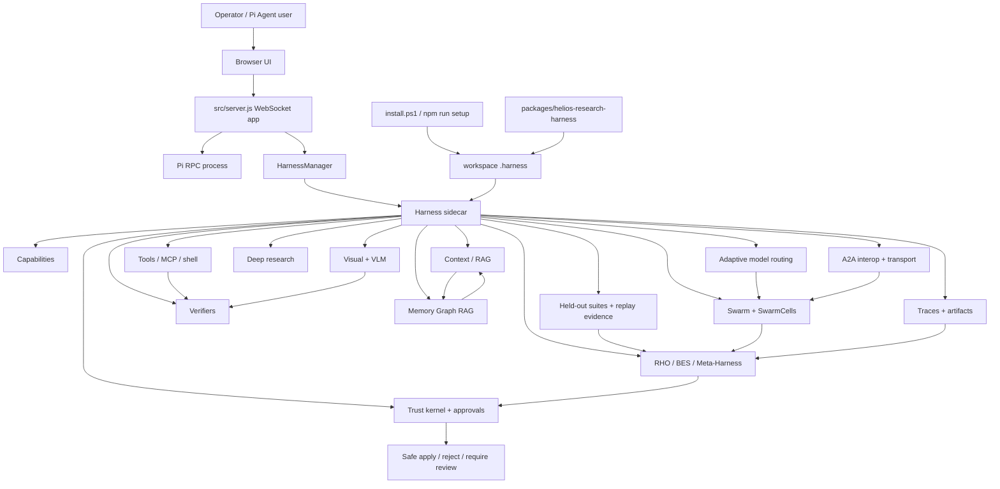
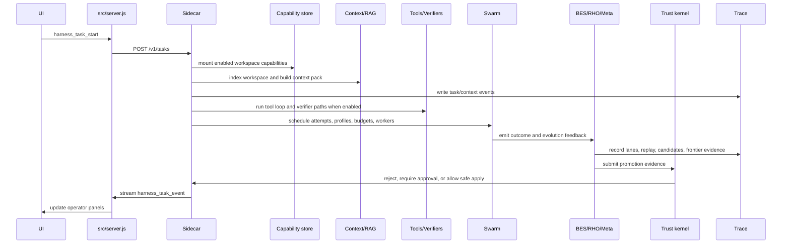

# Helios Forge Current Architecture

Fresh snapshot: June 11, 2026.

Helios Forge is a workspace-scoped research-agent harness around Pi Agent. The browser app and Pi bridge stay thin. The long-running research runtime lives in a local sidecar that owns capability mounting, traces, context, tools, verifiers, memory, RAG, graph construction, visual/VLM evidence, swarms, model routing, A2A interop, BES/RHO/meta-harness loops, and approval-gated apply.

The current system is best described as a deterministic, safety-gated evolutionary harness substrate with the first production-organism foundation lanes in place. It now has real modules for recursive swarm, memory, held-out benchmark manifests, replay scheduling, source-tree variant experiments, adaptive model routing, visual evidence, external A2A transport, and production autonomy policy. It is still not a fully autonomous paper-grade research organism, because the strongest loops are gated, evidence-only, offline/advisory by default, or human approval governed.

## Core Shape



Runtime has three major process surfaces:

| Surface | Primary files | Responsibility |
| --- | --- | --- |
| Browser and Pi-facing app | `src/server.js`, `public/app.js`, `src/pi/*` | Serve the UI, manage Pi RPC, forward chat/session/model commands, start/stop the harness, proxy harness events into the UI. |
| Harness process manager | `src/harness/harnessManager.js`, `src/harness/harnessClient.js`, `src/harness/workspaceSelection.js` | Start the sidecar for the selected workspace, health-check it, reconnect event streams, and preserve the active workspace boundary. |
| Sidecar runtime | `src/harness-sidecar/server.js` | Own the actual harness: task lifecycle, capability mounting, traces, artifacts, context, tools, verifiers, memory, research, swarms, BES/RHO/meta loops, approvals, and status events. |

## Workspace-Local Installation Model

Helios Forge is deliberately workspace-local by default.

`install.ps1` and `scripts/setup-helios-forge.js` create or preserve `.harness/config.yaml`, install the bundled package from `packages/helios-research-harness`, write `.harness/capabilities.json`, and build `.harness/runtime/capabilities.mount.json`.

The bundled package contributes:

- skills: deep research, visual debugging, meta harness;
- slash commands: `/research`, `/deep-research`, `/forge`;
- templates: research brief, eval promotion, visual fix report;
- Pi extensions: kwargs preservation and Helios bridge metadata.

The important split is:

```text
sidecar built-ins != installed workspace capabilities
```

The sidecar can expose built-in research, swarm, BES, VLM, or status routes even when a selected workspace has no installed package records. Real mounted capability state comes from `.harness/capabilities.json` and `.harness/runtime/capabilities.mount.json`.

## Task Runtime Flow



The sidecar exposes HTTP endpoints for health, Pi bridge state, events, capabilities, trace listing/replay, adaptive search status/replay, model council pass@k evaluation preparation, skill candidate review, task start, artifacts, and approval resolution. `src/server.js` wraps those endpoints in WebSocket commands used by the UI.

Every task can emit JSONL trace events under `.harness/traces/<task-id>/events.jsonl`, write artifacts under `.harness/artifacts`, and update operator-facing state through `harness_task_event`.

## Layer Map

| Layer | Current role | Main anchors |
| --- | --- | --- |
| Capability spine | Workspace-local registry and runtime mount manifest for skills, slash commands, templates, MCPs, Pi extensions, and profiles. | `src/harness-sidecar/capabilities/*`, `scripts/setup-helios-forge.js` |
| Context and RAG | Workspace indexing, retrieval, context packs, graph RAG composition, memory-aware and hierarchical retrieval. | `src/harness-sidecar/rag/*`, `src/harness-sidecar/context/*` |
| Tools and verifiers | Default tools, scoped shell, MCP runtime/policy, verifier selection, verifier execution, final validation. | `src/harness-sidecar/tools/*` |
| Visual/VLM | Screenshots, PDF/OCR/diagram/plot workers, visual diffs, visual verifier evidence, visual benchmark cases, gated visual SwarmCell runtime, multimodal request shaping. | `src/harness-sidecar/vlm/*`, `src/harness-sidecar/model/multimodalRequestBuilder.js` |
| Benchmarks and held-out suites | Root-constrained held-out suite manifests with domains, metric weights, quarantine metadata, safe fixture refs, and deterministic persistence. | `src/harness-sidecar/benchmarks/*` |
| Memory Graph RAG | Local observations, gated model-assisted extraction policy, SwarmCell memory merge, global schema/fact/passage layers, conflict adjudication, graph construction, runtime persistence. | `src/harness-sidecar/memory/*`, `src/harness-sidecar/rag/hierarchicalMemoryRetriever.js` |
| Research | Source discovery, ingestion, claim extraction, citation audit, contradiction finding, reports, implementation handoff. | `src/harness-sidecar/research/*` |
| Swarm | Attempt scheduling, role profiles, model/Pi/worktree/subagent workers, bounded concurrency, review, recombination, champion selection. | `src/harness-sidecar/swarm/*` |
| SwarmCell contracts | Normalize `taskOutput` and `evolutionOutput`; force local durable approval to false. | `src/harness-sidecar/swarm/swarmCellContracts.js`, `swarmCellRuntime.js`, `swarmCellRegistry.js` |
| BES | Subgoals, adaptive search, AB/MCTS model-choice evidence, lane contracts, lane runtime, dense subgoal verification, mutation/recombination, lineage, population evolution. | `src/harness-sidecar/bes/*` |
| RHO | Hard-case coreset selection, deterministic/model-backed embedding provider, replay schedule planner, replay batches, self-validation, self-consistency, self-preference, router hard cases. | `src/harness-sidecar/rho/*` |
| Meta-Harness | Candidate archives, local meta loops, harness experiment runs, full source-tree variant runner, isolated variants, frontier, production autonomy policy, promotion policies, governance. | `src/harness-sidecar/meta/*` |
| Skills and policies | Self-authored skill candidates and shadow policy evolution for context, budget, memory, MCP trust, research, visual, verifier, and tool loop behavior. | `src/harness-sidecar/skills/*`, `src/harness-sidecar/meta/*PolicyEvolution.js` |
| Model routing | Model profiles, OpenAI-compatible providers, routing provider, vLLM health, role-specialized council, adaptive model router state/reward/policy, pass@k ensemble evidence. | `src/harness-sidecar/model/*`, `src/harness-sidecar/swarm/modelCouncil.js`, `src/harness-sidecar/evals/modelCouncilPassK.js` |
| A2A/local interop | Agent cards, local durable inbox/outbox, endpoint records, negotiation envelopes, delegated tokens, external gateway quarantine, injectable A2A transport server/client. | `src/harness-sidecar/interop/*` |
| Trust and governance | Approval gates, promotion policy, trust-kernel checks, shared model-visible quarantine, production autonomy policy, audit, rollback and escalation metadata. | `src/harness-sidecar/core/trustKernelBoundary.js`, `src/harness-sidecar/security/*`, `src/harness-sidecar/meta/governanceLoop.js` |

## Evolution Spine

Helios has several learning loops. They are separate on purpose.

| Loop | What it learns from | What it produces | Durable authority |
| --- | --- | --- | --- |
| Swarm attempt | Task, role profile, context, budget, tools, model/Pi/worker output | Task result, verifier evidence, `evolutionOutput` | No |
| Local meta-harness | Attempt output, verifier results, hard-case tags | Local candidates and `local_meta.completed` | No |
| Local memory hierarchy | Attempt observations and memory proposals | Local/SwarmCell memory proposals and `local_memory.proposed` | No |
| Global Memory Graph RAG | Candidate schemas, facts, passages, conflicts, provenance, gated model-assisted extraction | Active global memory layers and graph snapshots | Limited memory promotion only |
| RHO replay | Trace failures, hard cases, held-out suites, embeddings, replay schedules, candidate/baseline runs | Replay, validation, consistency, preference, diversity, and domain-coverage evidence | No |
| BES lane runtime | Goals, candidates, domain evidence, adaptive model-choice evidence, dense subgoals, lineage | Evidence-only candidate envelopes and future hard cases | No |
| Global Meta-Harness | Candidate runs, source-tree variants, replay evidence, metrics, frontier records | Promotion evidence and approval-ready proposals | No direct apply |
| Production autonomy policy | Candidate type, risk, external evidence, visual/VLM evidence, rollback, verifier floor, operator gates | Eligibility, escalation, audit metadata, and blockers | No direct apply |
| Trust kernel | Candidate, paths, risk, approval, verifier/provenance/rollback evidence | Reject, require approval, or allow safe apply | Yes, by policy |

This is the central architecture rule:

```text
The system may generate evidence and proposals everywhere.
Only the trust-kernel path can make risky changes durable.
```

## Current Maturity

The repo has moved beyond paper-shaped notes. It has a broad deterministic substrate with 150-plus Node test files covering the harness, swarm, BES, RHO, memory, visual, model routing, A2A, capability, Pi bridge, and governance surfaces.

Current maturity is roughly:

| Scope | State |
| --- | --- |
| Local harness architecture | Strong and implemented. |
| Primitive modules | Strong for deterministic local operation. |
| Shared composition layer | Stronger than before: BES lane envelopes, lineage, visual references, model-router evidence, held-out suite manifests, local/global memory, A2A transport adapters, and capability-goal status are present. |
| Organism-level continuity | Partial but materially upgraded: the repo now has held-out suite storage, replay scheduling, source-tree variant execution, model routing evidence, visual SwarmCell evidence, and production autonomy evaluation. Repeated production cycles, dashboards, and queue providers are still future work. |
| Paper-grade autonomy | Not implemented end to end. The paper-grade pieces now exist as gated/advisory foundations, but production-sized autonomous loops, learned dense judgment, durable queues, multi-hop A2A lineage, operator dashboards, and broad eval coverage remain incomplete. |

The useful shorthand is:

```text
implemented substrate -> shared composition layer -> governed network-of-networks -> paper-grade autonomous organism
```

Helios is currently solidly in the first two bands, with a real but still gated foothold in the third.

Capability-goal status rows use a stricter maturity legend:

| Maturity | Meaning |
| --- | --- |
| Implemented substrate | The deterministic local capability exists with focused tests. |
| Production-gated capability | The lane has a real implementation path, but production feature gates, model-backed providers, external transports, dashboards, or repeated cycles are still required. |
| Production evidence available | Required persisted reports and operator/frontier dashboard snapshots exist for the lane. |
| Still-future paper-grade autonomy | Repeated production-sized autonomous operation, learned judgment, external durability, or nested execution remains unproven. |

## Security And Control Boundaries

The architecture treats model output, web content, tool output, external agent claims, visual OCR text, and generated candidates as untrusted until separately checked.

Important boundaries:

- Capability paths are normalized inside the active workspace.
- Runtime capability manifests are workspace-local.
- MCP and shell operations go through sidecar-owned policy surfaces.
- Shared model-visible quarantine redacts secrets, unsafe paths, traversal, oversize payloads, and authority-escalation claims before model-facing or external-facing use.
- Held-out suite manifests are root constrained, deterministic, and reject unsafe fixture refs or model-visible secret-shaped fields.
- SwarmCell outputs cannot approve durable local apply.
- BES lane output is evidence-only and promotion-blocked by default.
- Model council and adaptive model router decisions are evidence-only.
- The visual SwarmCell is disabled by default; visual-impacting evidence requires non-empty evidence refs and artifact hashes, and rejects absolute paths, URI paths, traversal, and malformed hash fields.
- A2A transport requires stable message/chunk IDs, peer-bound progress/cancel authority, replay rejection, external claim downgrading, and mutation blocking.
- Generated skills apply only into workspace-local generated-skill packages after review.
- Source patches, verifier config changes, capability installs, trust-kernel mutations, memory deletion, and similar risky changes require approval.
- Trust-kernel checks reject path escapes, verifier-floor weakening, audit disablement, secret-redaction disablement, soul/oversoul authority expansion, hidden lineage, self-approval, and missing patch paths.
- Production autonomy policy is eligibility and escalation metadata only; it cannot directly apply, mark external evidence verified, or weaken verifier floors.

This keeps the system self-improving without making it self-authorizing.

## Runtime State And Artifacts

| Path | Meaning |
| --- | --- |
| `.harness/config.yaml` | Workspace-local defaults, budgets, permissions, feature flags, and model/runtime settings. |
| `.harness/capabilities.json` | Installed capability records. |
| `.harness/runtime/capabilities.mount.json` | Enabled capability mount manifest used at runtime and passed back toward Pi. |
| `.harness/traces/<task-id>/events.jsonl` | Task event log for replay, audit, adaptive-search reconstruction, and future learning. |
| `.harness/artifacts/` | Text, report, graph, visual, and runtime artifacts. |
| `.harness/benchmarks/suites/` | Held-out benchmark suite manifests. |
| `.harness/memory/` | Memory candidates, global layers, graph snapshots, promoted records, and review state. |
| `.harness/meta/local-candidates/` | Local meta-harness candidate records scoped by cell. |
| `.harness/meta/harness-runs/` | Global harness experiment records. |
| `.harness/meta/harness-variants/` | Isolated candidate variant workspaces and source/config/trace/metric materialization. |
| `.harness/meta/skill-candidates/` | Shadow generated or adapted skills waiting for review. |
| `.harness/packages/generated-skills/` | Approved workspace-local generated skill output. |
| `.harness/verifiers.json` | Approved verifier configuration, when present. |

## Important Feature Gates

Most high-autonomy behavior is guarded by config or environment flags.

| Capability | Typical gate |
| --- | --- |
| Model-driven swarm | `features.modelDrivenSwarm` or `HELIOS_SWARM_MODEL_DRIVEN=1` |
| Pi-native swarm | `features.piNativeSwarm` or `HELIOS_PI_NATIVE_SWARM=1` |
| Worktree swarm | `features.worktreeSwarm` or `HELIOS_SWARM_WORKTREE=1` |
| Autonomous tool loop | `features.autonomousToolLoop` or `HELIOS_AUTONOMOUS_TOOL_LOOP=1` |
| Visual artifacts | `features.visualArtifacts` or preview URL configuration |
| Verifier evolution | `features.verifierEvolution` or `HELIOS_VERIFIER_EVOLUTION=1` |
| Adaptive search | `features.adaptiveSearch`, with advisory mode as the conservative default |
| Adaptive model router | `features.adaptiveModelRouter` plus router config |
| Safe apply | `features.safeApply` or `HELIOS_SAFE_APPLY=1`, still approval governed |
| Model-assisted memory extraction | `productionCapabilities.modelAssistedMemory`, default offline/evidence-only |
| Model-backed RHO embeddings | `productionCapabilities.modelBackedRhoEmbeddings`, default offline |
| Production A2A transport | `productionCapabilities.productionA2aTransport`, default offline |
| Production A2A queues | `productionCapabilities.productionA2aQueues`, default offline |
| Visual SwarmCell | `productionCapabilities.visualSwarmCell`, default offline/evidence-only |
| Visual replay suites | `productionCapabilities.visualReplaySuites`, default offline |
| Model-assisted BES judgment | `productionCapabilities.modelAssistedBesJudgment`, default offline/evidence-only |
| Council debate | `productionCapabilities.councilDebate`, default offline/evidence-only |
| Ensemble calibration | `productionCapabilities.ensembleCalibration`, default offline |
| Endpoint capacity recommendations | `productionCapabilities.endpointCapacityRecommendations`, default advisory |
| Operator dashboards | `productionCapabilities.operatorDashboards`, default offline |
| Production autonomy policy | `productionCapabilities.productionAutonomyPolicy`, default advisory/evidence-only |

The default setup file enables many features for local development, but promotion and apply authority still flows through policy and approvals.

## Current Architecture Reading Order

Use this order when coming back to the repo cold:

1. `README.md` for installation and workspace-local scope.
2. `src/server.js` for the browser/Pi wrapper and WebSocket command surface.
3. `src/harness/harnessManager.js` for sidecar lifecycle.
4. `src/harness-sidecar/server.js` for task orchestration and event wiring.
5. `src/harness-sidecar/capabilities/capabilityStore.js` and `scripts/setup-helios-forge.js` for capability installation and mounting.
6. `src/harness-sidecar/swarm/swarmOrchestrator.js` and `src/harness-sidecar/swarm/swarmCellContracts.js` for the swarm execution boundary.
7. `src/harness-sidecar/benchmarks/heldOutSuiteSchema.js` and `heldOutSuiteStore.js` for held-out suite manifests.
8. `src/harness-sidecar/bes/laneRuntime.js`, `src/harness-sidecar/bes/modelChoiceMcts.js`, `src/harness-sidecar/rho/replayBatchRunner.js`, `src/harness-sidecar/rho/embeddingProvider.js`, and `src/harness-sidecar/rho/replaySchedulePlanner.js` for the evidence and replay spine.
9. `src/harness-sidecar/memory/memoryGraphRuntime.js`, `src/harness-sidecar/memory/memoryExtractionSociety.js`, and `src/harness-sidecar/rag/hierarchicalMemoryRetriever.js` for memory hierarchy and gated model-assisted extraction.
10. `src/harness-sidecar/meta/sourceTreeVariantRunner.js`, `src/harness-sidecar/meta/productionAutonomyPolicy.js`, and `src/harness-sidecar/meta/promotionPolicy.js` for variant experiments and governance.
11. `src/harness-sidecar/interop/a2aTransportServer.js`, `a2aTransportClient.js`, and `externalAgentGateway.js` for A2A transport and external-agent boundaries.
12. `src/harness-sidecar/vlm/visualSwarmCell.js` and `src/harness-sidecar/vlm/visualBenchmarkCases.js` for first-class visual evidence.
13. `src/harness-sidecar/core/trustKernelBoundary.js` and `src/harness-sidecar/security/modelVisibleQuarantine.js` for the non-self-authorizing boundary.
14. `docs/architecture/paper-implementation-alignment.md` and `docs/architecture/evolutionary-agentic-organism-gap-map.md` for paper-gap framing and target-state roadmap.

## Target-State Delta

The next architecture work should not add a new clever subsystem in isolation. The repo now has the foundation lanes. The highest-leverage remaining work is to make those lanes continuous, measured, and production-sized:

1. Turn held-out suite manifests and RHO schedules into recurring replay cycles with persisted reports and frontier dashboards.
2. Connect source-tree variant execution to larger autonomous Meta-Harness campaigns while keeping active workspace mutation approval-gated.
3. Move RHO from deterministic fallback/model-adapter hooks toward production-sized grouped rerolls, richer self-preference evidence, and longitudinal replay budgets.
4. Add guarded memory provenance resolution agents and larger eval coverage around the model-assisted extraction society.
5. Deepen BES lanes so forward/backward search, AB/MCTS model choice, and dense subgoal judgment affect more live candidate paths.
6. Turn visual/VLM evidence into reusable replay suites and policy frontier evidence across UI, PDF, OCR, chart, artifact, and diagram tasks.
7. Extend A2A transport with restart-persistent production queue providers, issuer-secret providers, and multi-hop lineage compaction.
8. Surface held-out suites, replay cycles, A2A transport status, visual evidence, and autonomy summaries in operator dashboards without adding apply/promote buttons.
9. Harden endpoint capacity recommendations, ensemble calibration, council debate evidence, rollback drills, autonomy levels, escalation rules, and audit overrides.

## Bottom Line

Helios Forge is currently a local, trace-driven, memory-grounded, safety-gated agent harness with a strong evolutionary substrate and the first production-organism foundation lanes. Its browser/Pi wrapper is intentionally thin; the sidecar is the real runtime. The architecture already supports swarm attempts, local/global memory, held-out benchmark manifests, RHO replay schedules, source-tree variants, BES/model-router evidence, visual/VLM signals, A2A transport adapters, and approval-gated promotion.

The honest claim is:

```text
Helios Forge can already behave like a governed self-improving harness in local deterministic form.
It now has gated foundations for the paper-grade organism loops.
The remaining gap is production scale, continuity, learned judgment, durable external networking, and operator-grade governance.
```
