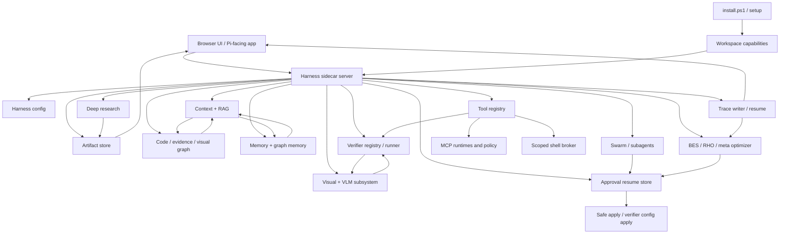
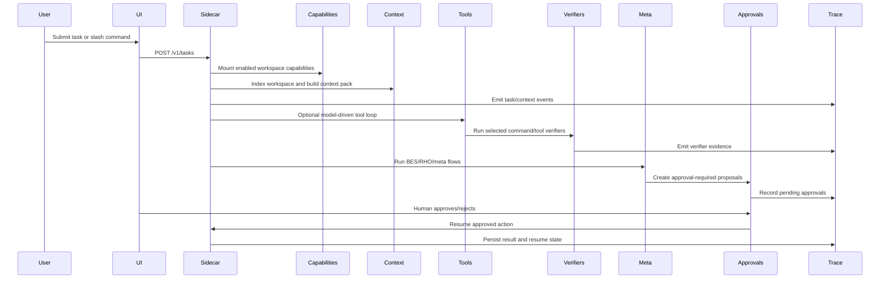
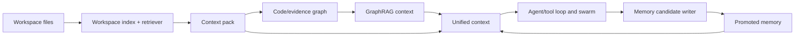
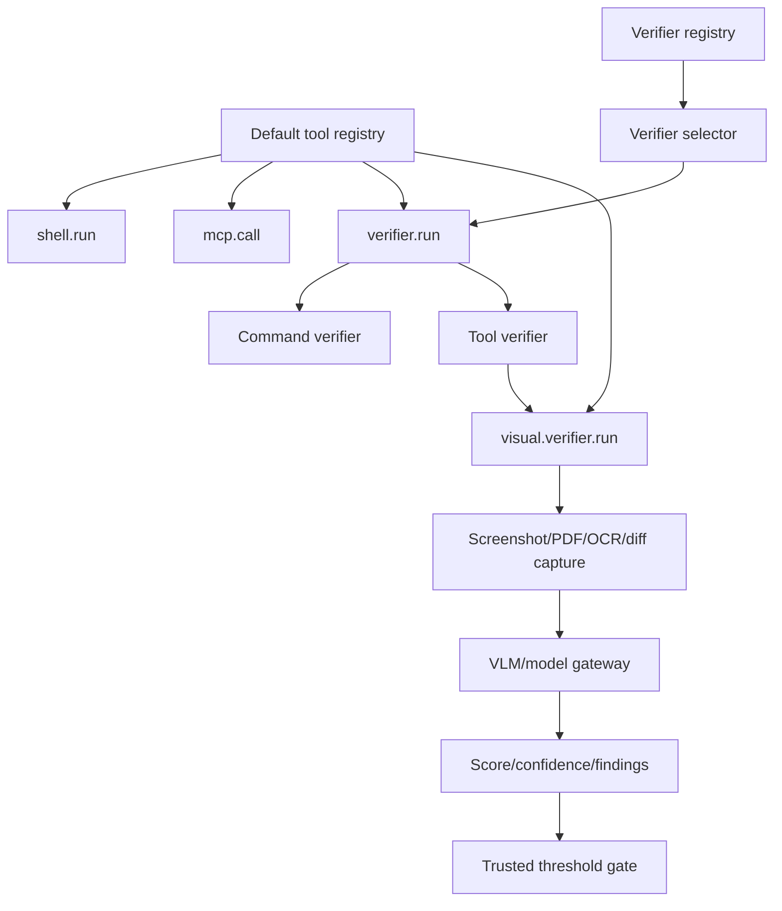
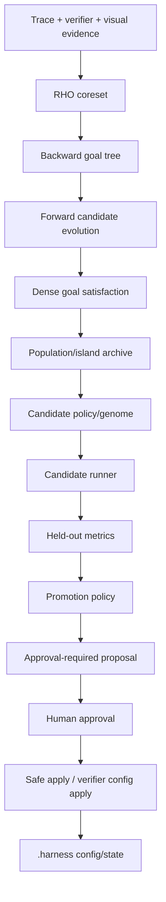
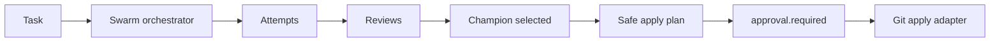

# Helios Forge Feature Architecture Map

This document maps the major Helios Forge features and how they relate at runtime. It is meant as an operator and developer orientation guide: what exists, where it lives, what it depends on, and how data moves through the harness.

## System Purpose

Helios Forge is a workspace-scoped harness around Pi Agent. It adds local capabilities, deep research, memory/RAG/graph context, tool execution, verification, visual/VLM checks, swarm attempts, BES/RHO/meta optimization, approval gates, and trace replay without mutating the global Pi install by default.

The core pattern is:

1. A task enters the sidecar.
2. The sidecar mounts workspace capabilities and builds context.
3. The agent/tool loop, verifiers, research, graph, memory, and swarm subsystems generate evidence.
4. Meta/BES/RHO components propose improvements.
5. Human approval gates decide whether anything risky is applied.
6. Traces and artifacts preserve enough state for resume, review, and future optimization.

## High-Level Architecture

## Feature Inventory

| Feature area | What it does | Primary code |
| --- | --- | --- |
| App shell and Pi bridge | Serves the local UI, connects to Pi RPC, preserves Pi model args through the optional kwargs extension. | `src/server.js`, `src/piRpcManager.js`, `packages/helios-research-harness` |
| Installer and local harness setup | Installs dependencies, writes workspace-local `.harness` config, installs bundled package, mounts capabilities, runs release smoke. | `install.ps1`, `scripts/setup-helios-forge.js` |
| Capability management | Stores enabled skills, slash commands, templates, MCP records, and Pi extension records for the workspace. | `src/harness-sidecar/capabilities/*` |
| Sidecar orchestration | Owns task lifecycle, emits runtime events, wires subsystems, records task state, artifacts, approvals, and traces. | `src/harness-sidecar/server.js` |
| Tool loop | Lets model-driven runtime call registered tools with recovery and approval semantics. | `src/harness-sidecar/tools/toolLoopController.js`, `src/harness-sidecar/tools/defaultToolRegistry.js` |
| Tool registry and shell broker | Exposes scoped tools such as shell, verifier, MCP call, and visual verifier; enforces workspace-scoped shell execution. | `src/harness-sidecar/tools/*` |
| MCP startup and security | Starts MCP runtimes from installed capability records and applies policy/quarantine to tool calls and suspicious output. | `src/harness-sidecar/tools/mcpCapabilityRuntime.js`, `mcpPolicy.js`, `mcpPoisoningEval.js` |
| Verifier registry and runner | Loads default/configured verifiers, selects relevant verifiers for changed files, runs command/tool verifiers, emits evidence. | `src/harness-sidecar/tools/verifierRegistry.js`, `verifierSelector.js`, `verifierRunner.js` |
| Visual verifier | Captures visual artifacts, calls VLM judge/model gateway, enforces trusted score/confidence thresholds, returns verifier evidence. | `src/harness-sidecar/vlm/visualVerifier.js`, `visualVerifierRubric.js` |
| Production visual artifacts | Browser screenshots, PDF page artifacts, OCR metadata, visual diffs, and visual workers with unavailable defaults. | `src/harness-sidecar/vlm/productionArtifactCapture.js`, `browserPreviewCapture.js`, `ocrWorker.js`, `pdfPageWorker.js`, `visualDiffWorker.js` |
| VLM native analysis | Interprets diagrams, figures, plots, runtime preview images, and visual context artifacts. | `src/harness-sidecar/vlm/*` |
| RAG and context packs | Indexes workspace files, retrieves task-relevant context, builds context packs, composes graph/memory/RAG context. | `src/harness-sidecar/rag/*` |
| Context pressure and working memory | Tracks context window pressure, compresses or drops lower-priority items, preserves important facts. | `src/harness-sidecar/context/*` |
| Code and evidence graph | Builds code graph, import/call heuristics, claim/evidence graph, experiment graph, visual graph, and impact analysis. | `src/harness-sidecar/graph/*` |
| Memory and graph memory | Writes memory candidates, scores corpus, promotes useful memory, stores graph snapshots and retrieves promoted context. | `src/harness-sidecar/memory/*` |
| Deep Research v2 | Builds research briefs, discovers/ingests sources, extracts claims, checks citations/contradictions, writes reports and handoff artifacts. | `src/harness-sidecar/research/*` |
| Experiments | Proposes experiments, queues approved runs, tracks runs, compares metrics, gates noisy deltas, writes decisions and reports. | `src/harness-sidecar/experiments/*` |
| Bidirectional BES and population evolution | Builds backward goal trees, scores dense goal satisfaction, alternates forward candidates with backward refinement, recombines partial progress, and runs Shinka-style population/island/archive evolution. | `src/harness-sidecar/bes/*` |
| RHO coreset | Selects high-signal traces and verifier cases for optimization: failures, ambiguity, cost, flakiness, false positives/negatives. | `src/harness-sidecar/rho/coresetBuilder.js` |
| Meta optimizer | Generates approval-ready policy candidates using BES/RHO evidence and promotion gates. | `src/harness-sidecar/meta/*` |
| Verifier evolution | Evolves verifier policies through genomes, held-out cases, BES/RHO candidate generation, archive, and human-gated promotion. | `src/harness-sidecar/meta/verifier*.js`, `src/harness-sidecar/tools/verifierConfigApply.js` |
| Swarm and subagents | Schedules attempts, runs dry-run or model/worktree attempts, reviews, recombines, chooses champion, proposes safe apply. | `src/harness-sidecar/swarm/*` |
| Collaboration and safe merge | Tracks locks, leases, roles, task claims, duplicate tasks, annotations, conflicts, merge manager. | `src/harness-sidecar/collaboration/*` |
| Approvals and safe apply | Stores pending actions, resumes approved actions exactly once, applies champion/change/verifier config only after approval. | `src/harness-sidecar/core/approvalResume.js`, `tools/gitApplyAdapter.js`, `tools/verifierConfigApply.js` |
| Reliability and recovery | Categorizes failures, repairs malformed tool calls, detects no-progress loops, records degraded modes. | `src/harness-sidecar/reliability/*` |
| Budgeting | Tracks tool/verifier/artifact budgets, hierarchy, dashboards, gates, and cost-aware allocation. | `src/harness-sidecar/budget/*` |
| Traces, resume, replay | Writes event JSONL, summarizes/compacts traces, reconstructs resumable state, exposes trace replay. | `src/harness-sidecar/core/trace*.js`, `taskResume.js` |
| UI operator surface | Displays harness controls, capabilities, traces, memory/RAG/graph, visual artifacts, subagents, verifier evolution status. | `public/index.html`, `public/app.js` |
| External agent interop | Normalizes agent cards, routes agents, redacts credentials, issues delegated capability tokens, gates mutation. | `src/harness-sidecar/interop/*` |

## Runtime Flow

## How The Major Systems Relate

### Context, RAG, Graph, and Memory

These four systems form the agent's knowledge layer.

- RAG indexes workspace files and retrieves likely-relevant snippets.
- Context packs bound retrieved material to a budgeted prompt profile.
- Graph modules turn code, imports, calls, claims, experiments, visuals, and impact signals into structured relations.
- Memory stores durable lessons and promoted context that can be reused across later tasks.

Relationship:

### Tools, Verifiers, and Visual/VLM

Tools provide controlled actions. Verifiers turn actions into evidence. Visual/VLM extends verification to browser, PDF, OCR, image, and layout states.

- `shell.run` is workspace-scoped and output-capped.
- `mcp.call` is policy-gated.
- `verifier.run` selects/runs verifier records.
- `visual.verifier.run` captures artifacts and judges them through VLM evidence.
- Visual verifier pass/fail is threshold-derived; the model's own `passed` field is advisory.

Relationship:

### BES, RHO, Meta, and Verifier Evolution

These systems make the harness improve itself without allowing direct self-application.

- RHO picks high-signal cases from traces, verifier outcomes, and visual/VLM verifier evidence.
- Bidirectional BES uses those cases to build backward goal trees, score partial progress densely, and generate/recombine forward candidates.
- The population runner applies Shinka-style generations, islands, correctness gates, visual/VLM case propagation, and archives.
- Meta promotion policy evaluates whether a candidate is safe and useful.
- Human approval gates are mandatory for applying risky changes.
- Verifier evolution follows the same pattern, but its output is verifier config candidates.

Relationship:

### Swarm, Collaboration, and Safe Apply

Swarm attempts produce candidate solutions. Collaboration and safe apply decide whether any candidate can mutate the workspace.

- Attempts can be dry-run, model-driven, or worktree-backed depending on feature flags and injected adapters.
- Review and recombination can produce a champion.
- Champion apply is proposed, not automatically applied.
- Approval resume ensures approved actions run once.

Relationship:

## Feature Gates And Runtime Flags

Most advanced behavior is present in code but gated so local testing can stay conservative.

| Feature | Enabled by |
| --- | --- |
| Model-driven swarm | `.harness/config.yaml` `features.modelDrivenSwarm: true` or `HELIOS_SWARM_MODEL_DRIVEN=1` |
| Autonomous tool loop | `.harness/config.yaml` `features.autonomousToolLoop: true` or `HELIOS_AUTONOMOUS_TOOL_LOOP=1` |
| Worktree swarm | `.harness/config.yaml` `features.worktreeSwarm: true` or `HELIOS_SWARM_WORKTREE=1` |
| Safe apply | `.harness/config.yaml` `features.safeApply: true` or `HELIOS_SAFE_APPLY=1` |
| Production visual artifacts | `.harness/config.yaml` `features.visualArtifacts: true`, preview URL config, or `HELIOS_WEB_PREVIEW_URL` |
| Verifier evolution | `.harness/config.yaml` `features.verifierEvolution: true` or `HELIOS_VERIFIER_EVOLUTION=1` |

## Data And Artifact Locations

| Location | Purpose |
| --- | --- |
| `.harness/config.yaml` | Workspace-local harness settings and feature gates |
| `.harness/capabilities.json` | Installed capability records |
| `.harness/runtime/capabilities.mount.json` | Runtime mount manifest for enabled capabilities |
| `.harness/traces/<task-id>/events.jsonl` | Event trace for task replay/resume |
| `.harness/artifacts/` | Text and runtime artifacts |
| `.harness/memory/` | Memory candidates, promoted records, graph snapshots |
| `.harness/visual/<task-id>/` | Visual screenshots, diffs, OCR/PDF outputs |
| `.harness/meta/verifier-candidates/` | Archived verifier-evolution candidates |
| `.harness/verifiers.json` | Workspace verifier configuration, when verifier candidates are approved |

## Security And Control Boundaries

The harness treats generated output, web pages, tool results, and model output as untrusted.

Important controls:

- Workspace-scoped paths for shell, artifacts, package install, visual workers, and verifier config writes.
- Approval gates for mutation, safe apply, champion apply, change proposals, and verifier config apply.
- Secret redaction in capability records and external-agent envelopes.
- MCP policy and poisoning checks before model-visible tool output is trusted.
- Visual verifier events avoid binary image payloads; private URL components and OCR text are not written into default artifact metadata.
- VLM pass/fail cannot self-certify: score and confidence thresholds decide visual verifier status.
- Verifier evolution proposes candidates and archives evidence; it does not directly promote or apply without human approval.

## Operator Reading Map

Start here for common questions:

- "What is running?" Read `src/harness-sidecar/server.js`.
- "What tools can the model call?" Read `src/harness-sidecar/tools/defaultToolRegistry.js`.
- "How are verifiers selected?" Read `src/harness-sidecar/tools/verifierSelector.js`.
- "How does visual verification work?" Read `src/harness-sidecar/vlm/visualVerifier.js`.
- "How does verifier evolution work?" Read `src/harness-sidecar/meta/verifierEvolutionLoop.js`.
- "How should swarm use meta evolution?" Read `docs/architecture/swarm-evolution-integration-plan.md`.
- "Where are approvals handled?" Read `src/harness-sidecar/core/approvalResume.js`.
- "Where are traces written?" Read `src/harness-sidecar/core/traceWriter.js`.
- "Where is UI state shown?" Read `public/app.js`.

## Remaining Hardening Notes

These are known follow-up areas rather than blockers for local testing:

- Stable delegated-token issuer secret injection for multi-process or restart-persistent external-agent delegation.
- Broader MCP quarantine coverage for future model-visible fields beyond current returned-content scanning.
- Rename or clarify code-impact events that use context-pack paths as seed files, so they are not mistaken for actual diff changed files.
- Expand the operator dashboard from data events into a fuller dedicated browser panel for context pressure, recovery, verifier evolution, and budget alerts.
