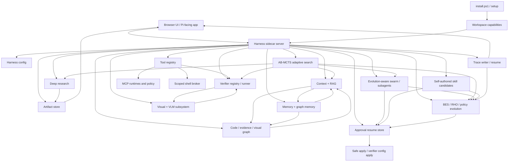
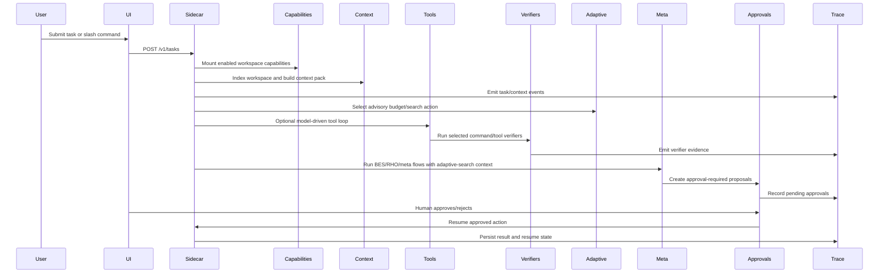
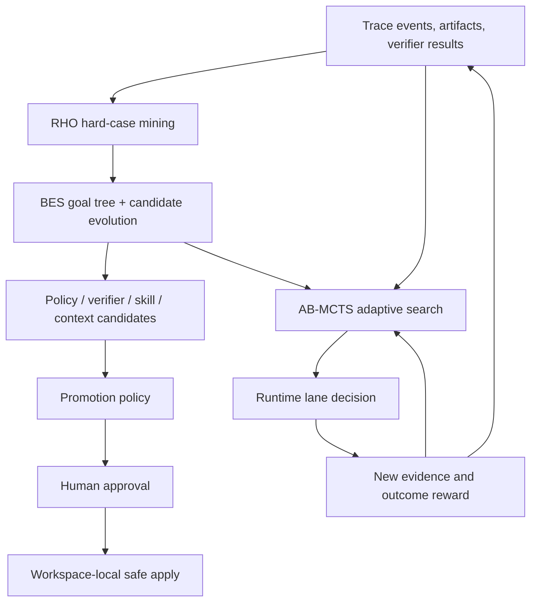
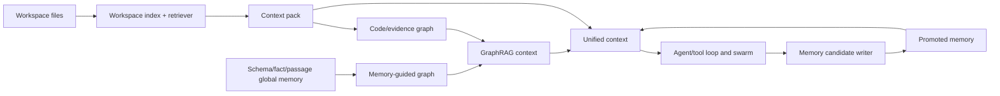
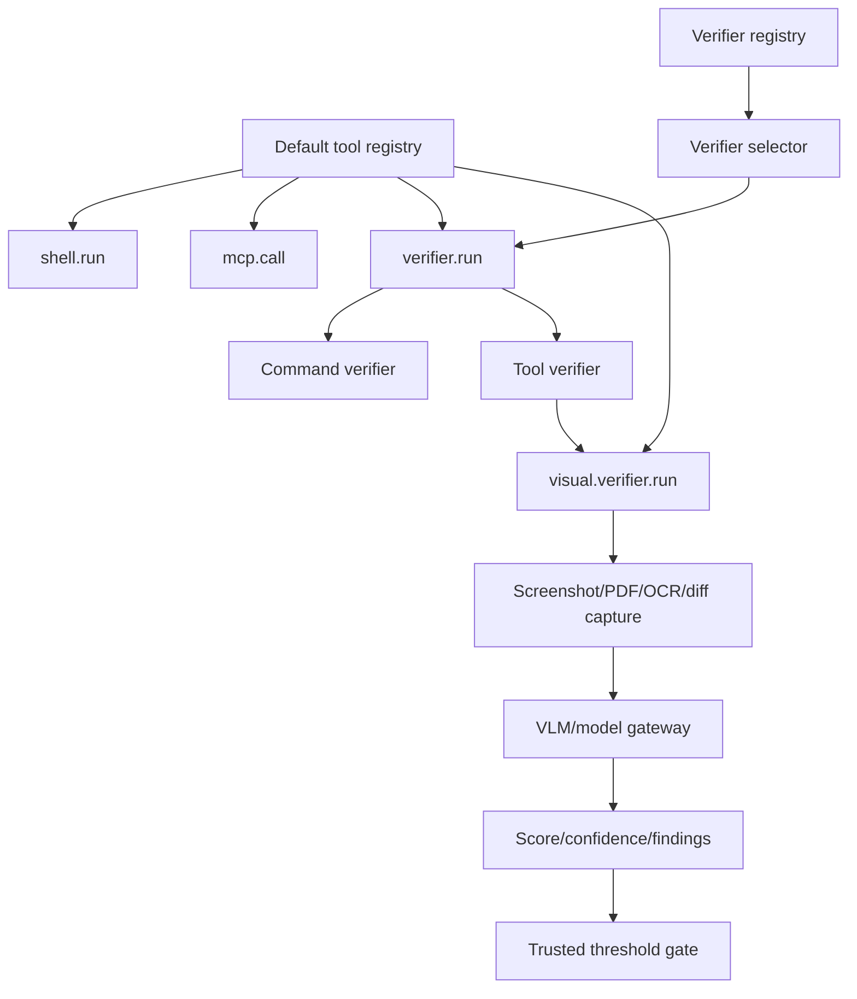
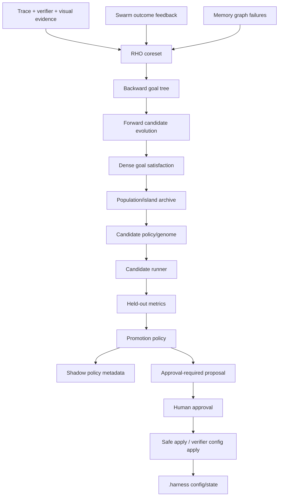
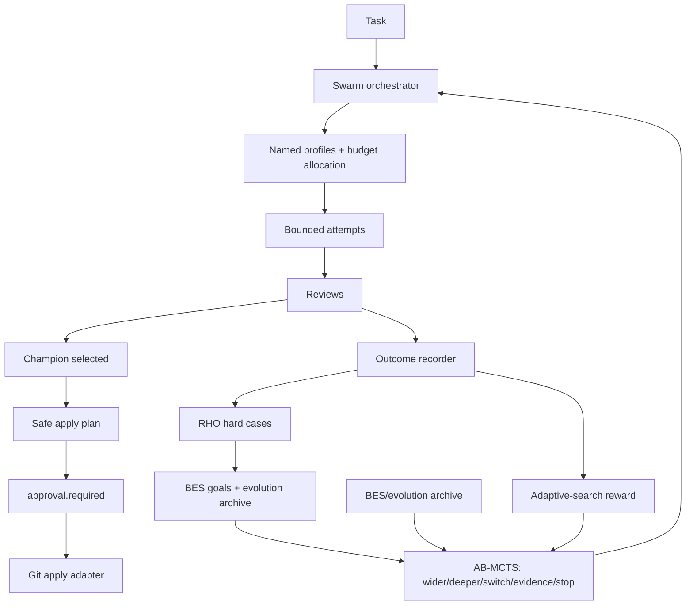
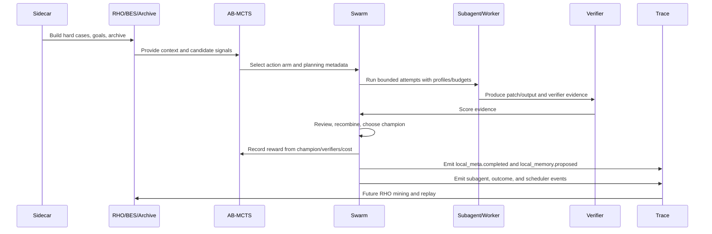
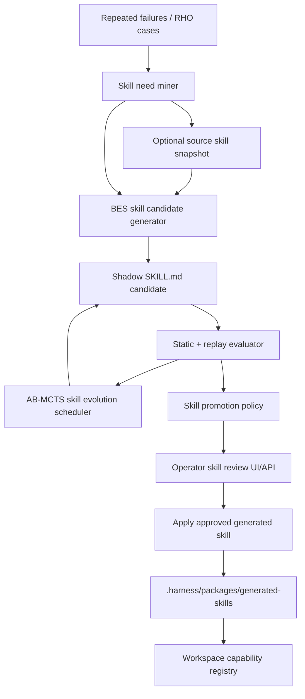

# Helios Forge Feature Architecture Map

This document maps the major Helios Forge features and how they relate at runtime. It is meant as an operator and developer orientation guide: what exists, where it lives, what it depends on, and how data moves through the harness.

## System Purpose

Helios Forge is a workspace-scoped harness around Pi Agent. It adds local capabilities, deep research, memory/RAG/graph context, tool execution, verification, visual/VLM checks, swarm attempts, BES/RHO/meta optimization, approval gates, and trace replay without mutating the global Pi install by default.

The core pattern is:

1. A task enters the sidecar.
2. The sidecar mounts workspace capabilities and builds context.
3. Adaptive search decides where to spend the next unit of work: wider search, deeper refinement, worker/profile switching, evidence gathering, or stopping.
4. The agent/tool loop, verifiers, research, graph, memory, visual/VLM, and swarm subsystems generate evidence.
5. Meta/BES/RHO components mine that evidence and propose improvements.
6. Human approval gates decide whether anything risky is applied.
7. Traces and artifacts preserve enough state for resume, review, replay, and future optimization.

## High-Level Architecture

## Feature Inventory

| Feature area | What it does | Primary code |
| --- | --- | --- |
| App shell and Pi bridge | Serves the local UI, connects to Pi RPC, preserves Pi model args through the optional kwargs extension. | `src/server.js`, `src/piRpcManager.js`, `packages/helios-research-harness` |
| Installer and local harness setup | Installs dependencies, writes workspace-local `.harness` config, installs bundled package, mounts capabilities, runs release smoke. | `install.ps1`, `scripts/setup-helios-forge.js` |
| Capability management | Stores enabled skills, slash commands, templates, MCP records, and Pi extension records for the workspace. | `src/harness-sidecar/capabilities/*` |
| Sidecar orchestration | Owns task lifecycle, emits runtime events, wires subsystems, records task state, artifacts, approvals, and traces. | `src/harness-sidecar/server.js` |
| Tool loop | Lets model-driven runtime call registered tools with recovery and approval semantics. | `src/harness-sidecar/tools/toolLoopController.js`, `src/harness-sidecar/tools/defaultToolRegistry.js` |
| Tool registry and shell broker | Exposes scoped tools such as shell, verifier, MCP call, and visual verifier; enforces workspace-scoped shell execution. | `src/harness-sidecar/tools/*` |
| MCP startup and security | Starts MCP runtimes from installed capability records and applies policy/quarantine to tool calls and suspicious output. | `src/harness-sidecar/tools/mcpCapabilityRuntime.js`, `mcpPolicy.js`, `mcpPoisoningEval.js` |
| Verifier registry and runner | Loads default/configured verifiers, selects relevant verifiers for changed files, runs command/tool verifiers, emits evidence. | `src/harness-sidecar/tools/verifierRegistry.js`, `verifierSelector.js`, `verifierRunner.js` |
| Visual verifier | Captures visual artifacts, calls VLM judge/model gateway, enforces trusted score/confidence thresholds, returns verifier evidence. | `src/harness-sidecar/vlm/visualVerifier.js`, `visualVerifierRubric.js` |
| Production visual artifacts | Browser screenshots, PDF page artifacts, OCR metadata, visual diffs, and visual workers with unavailable defaults. | `src/harness-sidecar/vlm/productionArtifactCapture.js`, `browserPreviewCapture.js`, `ocrWorker.js`, `pdfPageWorker.js`, `visualDiffWorker.js` |
| VLM native analysis | Interprets diagrams, figures, plots, runtime preview images, and visual context artifacts. | `src/harness-sidecar/vlm/*` |
| RAG and context packs | Indexes workspace files, retrieves task-relevant context, builds context packs, composes graph/memory/RAG context. | `src/harness-sidecar/rag/*` |
| Context pressure and working memory | Tracks context window pressure, compresses or drops lower-priority items, preserves important facts. | `src/harness-sidecar/context/*` |
| Code and evidence graph | Builds code graph, import/call heuristics, claim/evidence graph, experiment graph, visual graph, and impact analysis. | `src/harness-sidecar/graph/*` |
| Memory and graph memory | Writes memory candidates, scores corpus, promotes useful memory, stores graph snapshots and retrieves promoted context. | `src/harness-sidecar/memory/*` |
| MemGraphRAG-style global memory | Maintains schema/fact/passage layers, pending-to-active fact promotion, evidence-backed conflict adjudication, graph bridging, runtime snapshots, and memory-aware retrieval. | `src/harness-sidecar/memory/globalMemoryLayers.js`, `memoryGraphConstructor.js`, `memoryConflictAdjudicator.js`, `memoryGraphRuntime.js`, `src/harness-sidecar/rag/memoryAwareGraphRetriever.js`, `hierarchicalMemoryRetriever.js` |
| Deep Research v2 | Builds research briefs, discovers/ingests sources, extracts claims, checks citations/contradictions, writes reports and handoff artifacts. | `src/harness-sidecar/research/*` |
| Experiments | Proposes experiments, queues approved runs, tracks runs, compares metrics, gates noisy deltas, writes decisions and reports. | `src/harness-sidecar/experiments/*` |
| AB-MCTS adaptive search | Allocates online budget between going wider, going deeper, switching worker/profile, gathering evidence, and stopping/promoting. It is advisory by default and replayable from traces. | `src/harness-sidecar/bes/adaptiveSearchScheduler.js`, `adaptiveSearchAdapters.js`, `adaptiveSearchApi.js` |
| Bidirectional BES and population evolution | Builds backward goal trees, scores dense goal satisfaction, alternates forward candidates with backward refinement, recombines partial progress, and runs Shinka-style population/island/archive evolution. | `src/harness-sidecar/bes/*` |
| Shared BES lane runtime | Wraps policy, memory, research, skill, swarm, tool, budget, visual, compaction, MCP-trust, and harness candidates in common evidence-only envelopes with lineage, dense subgoals, optional RHO replay, A2A refs, memory graph context, visual evidence, and promotion-blocking summaries. Emits `bes_lane.started`, `bes_lane.completed`, `bes_lane.blocked`, and status snapshots in live runtime paths. | `src/harness-sidecar/bes/laneRuntime.js`, `laneEvidence.js`, `src/harness-sidecar/meta/*PolicyEvolution.js`, `src/harness-sidecar/skills/skillEvolution.js`, `src/harness-sidecar/swarm/evolutionSwarmPlanner.js`, `src/harness-sidecar/server.js` |
| RHO coreset | Selects high-signal traces, verifier cases, MemGraphRAG construction failures, and swarm hard cases for optimization. | `src/harness-sidecar/rho/coresetBuilder.js` |
| Meta optimizer | Generates approval-ready policy candidates using BES/RHO evidence and promotion gates. | `src/harness-sidecar/meta/*` |
| Shadow policy evolution | Proposes and evaluates shadow-only context, tool-loop, budget, visual/VLM, memory, MCP trust, and research policies without self-applying them. | `src/harness-sidecar/meta/*PolicyEvolution.js` |
| Verifier evolution | Evolves verifier policies through genomes, held-out cases, BES/RHO candidate generation, archive, and human-gated promotion. | `src/harness-sidecar/meta/verifier*.js`, `src/harness-sidecar/tools/verifierConfigApply.js` |
| Swarm and subagents | Schedules seeded, ToolTree, or evolution-archive attempts; assigns named profiles; allocates budgets; runs bounded attempts; reviews, recombines, chooses champion, proposes safe apply. | `src/harness-sidecar/swarm/*` |
| SwarmCell contracts and local meta | Normalizes task/evolution output, defines SwarmCell roles, runs local meta feedback, archives local candidates, blocks durable self-approval, and emits local meta/memory events. | `src/harness-sidecar/swarm/swarmCellContracts.js`, `swarmCellRegistry.js`, `swarmCellRuntime.js`, `src/harness-sidecar/meta/local*.js` |
| Swarm outcome feedback | Converts champion success, rejected attempts, unsafe patches, missing verifier evidence, and visual failures into RHO/BES/meta feedback. | `src/harness-sidecar/swarm/swarmOutcomeRecorder.js`, `src/harness-sidecar/server.js` |
| RHO replay and self-preference | Runs grouped baseline/candidate replays and scores self-validation, self-consistency, and pairwise preference as promotion evidence. | `src/harness-sidecar/rho/replayBatchRunner.js`, `selfValidation.js`, `selfConsistency.js`, `selfPreferenceJudge.js` |
| BES lane contracts and lineage | Declares candidate/verifier units per lane, applies trajectory operators, scores dense subgoals, and records ancestry across evolved candidates. | `src/harness-sidecar/bes/laneContracts.js`, `trajectoryOperators.js`, `denseSubgoalVerifier.js`, `globalLineageTracker.js` |
| Global harness experiments | Writes Meta-Harness-style run directories, compares baseline/candidate metrics, and updates the global frontier without self-applying changes. | `src/harness-sidecar/meta/harnessRunStore.js`, `harnessExperimentRunner.js`, `harnessFrontier.js` |
| Self-authored skill evolution | Mines repeated hard cases, snapshots source skills, generates shadow `SKILL.md` candidates, evaluates them, and approval-installs winners as workspace-local generated skills. | `src/harness-sidecar/skills/*` |
| Collaboration and safe merge | Tracks locks, leases, roles, task claims, duplicate tasks, annotations, conflicts, merge manager. | `src/harness-sidecar/collaboration/*` |
| Approvals and safe apply | Stores pending actions, resumes approved actions exactly once, applies champion/change/verifier config only after approval, and reports auto-approval eligibility metadata without bypassing gates. | `src/harness-sidecar/core/approvalResume.js`, `src/harness-sidecar/meta/autoApprovalPolicy.js`, `tools/gitApplyAdapter.js`, `tools/verifierConfigApply.js` |
| Trust-kernel boundary | Rejects unsafe optimizer proposals before durable apply, including path escapes, verifier-floor weakening, audit/secret-redaction disablement, missing patch paths, source patches without approval, and visual-task mutations without artifact-backed visual evidence. | `src/harness-sidecar/core/trustKernelBoundary.js` |
| Reliability and recovery | Categorizes failures, repairs malformed tool calls, detects no-progress loops, records degraded modes. | `src/harness-sidecar/reliability/*` |
| Budgeting | Tracks tool/verifier/artifact budgets, hierarchy, dashboards, gates, and cost-aware allocation. | `src/harness-sidecar/budget/*` |
| Traces, resume, replay | Writes event JSONL, summarizes/compacts traces, reconstructs resumable state, exposes trace replay. | `src/harness-sidecar/core/trace*.js`, `taskResume.js` |
| UI operator surface | Displays harness controls, capabilities, traces, memory/RAG/graph, visual artifacts, subagents, verifier evolution status, adaptive-search state, skill candidate review, and replay results. | `public/index.html`, `public/app.js` |
| External agent interop | Normalizes agent cards, routes agents, redacts credentials, issues scoped delegated capability tokens, gates mutation, stores durable local inbox/outbox records, retries dispatch, records progress/cancel, discovers peers, and builds streaming envelopes. | `src/harness-sidecar/interop/*` |
| BES/A2A lineage bridge | Preserves reference-only BES lane, RHO case, memory graph, candidate, lineage, trust, and required-verification metadata across local A2A envelopes and marks external A2A claims unverified at the gateway boundary. | `src/harness-sidecar/interop/a2aSwarmEnvelope.js`, `agentRouter.js`, `externalAgentGateway.js`, `src/harness-sidecar/rag/hierarchicalMemoryRetriever.js` |
| Visual evidence bundles | Converts visual verifier output into artifact-backed visual evidence nodes, RHO visual cases, memory graph references, and BES evidence summaries. | `src/harness-sidecar/vlm/visualEvidence.js`, `src/harness-sidecar/bes/laneEvidence.js`, `src/harness-sidecar/bes/laneRuntime.js` |
| Governance and improvement loop | Plans scheduled replay jobs, tracks improvement budget, records rollback drills, summarizes frontier/governance status, applies autonomy levels, and emits escalation/override audit metadata. | `src/harness-sidecar/meta/governanceLoop.js`, `src/harness-sidecar/server.js` |

## Runtime Flow

## The Adaptive Meta-Harness Spine

Helios now has three related optimization layers. They are intentionally separate so the harness can learn without letting a single subsystem mutate everything at once.

| Layer | Role | Runtime effect | Promotion power |
| --- | --- | --- | --- |
| RHO | Retrospective hard-case selection. It finds traces, swarm failures, verifier misses, memory/RAG misses, and repeated skill needs worth learning from. | Chooses what evidence should guide optimization. | None directly. |
| BES / evolution | Candidate generation and dense scoring. It decomposes hard cases into goals, mutates policies/genomes/skills/verifiers, and archives useful or informative candidates. | Produces candidate plans, policies, skills, and verifier configs. | None directly. |
| AB-MCTS adaptive search | Online allocation. It chooses whether the next step should go wider, go deeper, switch worker/profile, gather evidence, or stop/promote. | Advises live runtime lanes and records outcomes for replay. | None directly. |

The important boundary is that optimization can recommend and rank candidates, but `promotionPolicy.js`, approval records, and safe apply modules decide whether anything becomes durable.

### What AB-MCTS Controls

AB-MCTS does not replace the meta harness. It allocates live effort across it.

- In the swarm, it annotates attempts with a selected arm and records champion/verifier rewards after the attempts finish.
- In the meta optimizer, it adds routing metadata when RHO/BES candidates are being generated from hard cases.
- In verifier selection, it can recommend normal verification, visual verification, extra evidence, or cheaper/stricter paths.
- In deep research, it can bias toward more sources, contradiction passes, synthesis refinement, or figure/visual evidence.
- In context/RAG, it can bias toward broader retrieval, graph-neighborhood deepening, memory review, or compaction.
- In skill evolution, it helps decide whether to generate more variants, refine a current candidate, gather replay evidence, or queue promotion.

The UI surfaces this through adaptive-search status, replay, and arm summaries. The API exposes the same through `/v1/adaptive-search/status` and `/v1/adaptive-search/replay`.

## How The Major Systems Relate

### Context, RAG, Graph, and Memory

These four systems form the agent's knowledge layer.

- RAG indexes workspace files and retrieves likely-relevant snippets.
- Context packs bound retrieved material to a budgeted prompt profile.
- Graph modules turn code, imports, calls, claims, experiments, visuals, and impact signals into structured relations.
- Memory stores durable lessons and promoted context that can be reused across later tasks.
- Global memory layers keep schemas, facts, and passages separate so graph construction can reuse stable knowledge and keep uncertain facts pending.
- Memory-aware graph retrieval uses active facts, provenance passages, type bridges, and similarity bridges as context evidence.

Relationship:

### Tools, Verifiers, and Visual/VLM

Tools provide controlled actions. Verifiers turn actions into evidence. Visual/VLM extends verification to browser, PDF, OCR, image, and layout states.

- `shell.run` is workspace-scoped and output-capped.
- `mcp.call` is policy-gated.
- `verifier.run` selects/runs verifier records.
- `visual.verifier.run` captures artifacts and judges them through VLM evidence.
- Visual verifier pass/fail is threshold-derived; the model's own `passed` field is advisory.

Relationship:

### BES, RHO, Meta, and Verifier Evolution

These systems make the harness improve itself without allowing direct self-application.

- RHO picks high-signal cases from traces, verifier outcomes, and visual/VLM verifier evidence.
- RHO also scores MemGraphRAG failures and swarm hard cases such as missing verifier evidence, unsafe patches, visual failures, and champion regressions.
- Bidirectional BES uses those cases to build backward goal trees, score partial progress densely, and generate/recombine forward candidates.
- The population runner applies Shinka-style generations, islands, correctness gates, visual/VLM case propagation, and archives.
- Meta promotion policy evaluates whether a candidate is safe and useful.
- Shadow policy evolvers propose subsystem-specific candidates for context, tool-loop, budget, visual, memory, MCP trust, and research behavior.
- Human approval gates are mandatory for applying risky changes.
- Verifier evolution follows the same pattern, but its output is verifier config candidates.

Relationship:

### Swarm, Collaboration, and Safe Apply

Swarm attempts produce candidate solutions. Collaboration and safe apply decide whether any candidate can mutate the workspace.

- Attempts can be dry-run, model-driven, Pi-native, or worktree-backed depending on feature flags and injected adapters.
- Attempt scheduling can use seeded strategies, ToolTree planning, BES/evolution archive/frontier evidence, and AB-MCTS adaptive-search actions.
- Named profiles make role, VLM access, tool caps, mutation permissions, and output contracts explicit.
- Fitness-aware budgets allocate more effort to strong candidates while preserving exploration and visual/VLM artifact budget.
- Bounded execution can run attempts concurrently when enabled while preserving deterministic result ordering.
- Review and recombination can produce a champion.
- Outcome feedback records champion success and hard cases back into RHO/BES/meta loops.
- Champion apply is proposed, not automatically applied.
- Approval resume ensures approved actions run once.

Relationship:

### Swarm Loop And Meta Harness Feedback

The swarm loop is one of the clearest places where the meta harness becomes useful at runtime:

1. **Pre-swarm meta context.** Earlier task phases build RHO cases, BES goal trees, evolution archives, context packs, memory/graph signals, and verifier/VLM evidence.
2. **Adaptive planning.** `attemptScheduler.js` chooses seeded, ToolTree, or evolution-aware attempts, then AB-MCTS annotates the plan with the selected arm.
3. **Profile and budget assignment.** `swarmOrchestrator.js` assigns agent profiles and optional evolution budgets so attempts have roles, tool permissions, model profiles, VLM access, and cost caps.
4. **Attempt execution.** Attempts run through deterministic dry-run, model-driven worker, Pi-native worker, command subagent, or worktree command lanes.
5. **Review and champion selection.** The reviewer scores safety, verifier evidence, patch shape, and contract completeness; recombination can merge approved outputs; champion selection chooses the strongest attempt.
6. **Outcome recording.** `swarmOutcomeRecorder.js` converts champion score, failed attempts, missing verifier evidence, unsafe patches, visual failures, and handoff quality into hard-case feedback.
7. **Reward and trace.** AB-MCTS receives outcome reward, while trace events preserve the decision, attempt timeline, and scheduler summary.
8. **Next optimization wave.** RHO mines those traces; BES/evolution generate better policies, profiles, verifier configs, or skills; promotion gates decide whether any candidate can become durable.

In short: the swarm explores possible solutions, the meta harness learns from that exploration, and AB-MCTS decides how aggressively to spend the next search step.

The hierarchical pass adds two operator-visible events to this loop:

- `local_meta.completed`: emitted after an attempt when local meta feedback is enabled. It reports the SwarmCell, attempt id, candidate count, archived candidates, and local mutation proposals.
- `local_memory.proposed`: emitted whenever local memory hierarchy feedback is enabled. It is independent of local meta feedback and forwards attempt-level `evolutionOutput.memoryProposals` plus deduped local-meta candidate memory proposals for global review.

These are review signals, not apply signals. They make local learning visible in the trace and UI without granting local agents durable authority.

### Evolutionary Loop Map

The main evolutionary loops are layered so each can be tested and stopped independently.

| Loop | Input | Output | Durable authority |
| --- | --- | --- | --- |
| SwarmCell attempt | task, role profile, context, budget | `taskOutput`, `evolutionOutput`, verifier evidence | no |
| Local meta-harness | attempt output, hard-case tags, verifier evidence | local candidates, `local_meta.completed` | no |
| Local memory hierarchy | local observations and memory proposals | pending local/global memory proposals, `local_memory.proposed` | no |
| Global MemGraphRAG | pending passages/schemas/facts and provenance | active global memory layers and graph snapshots | memory only through runtime policy |
| RHO replay | trace hard cases and candidate/baseline runners | validation, consistency, preference evidence | no |
| BES lane evolution | goals, candidates, evidence | mutated/recombined candidate families with lineage | no |
| Global harness experiment | candidate, baseline, metrics, rollback data | run directory, frontier update, promotion evidence | no |
| AB-MCTS adaptive search | live state and reward history | next action arm and scheduler summary | no |
| Trust kernel | candidate, risk metadata, approval record | reject, require approval, or safe apply | yes, by policy |

The key design rule is that loops may produce evidence and proposals, but only the trust-kernel path can make a risky change durable.

### Self-Authored Skill Flow

Skill evolution uses the same spine as swarm evolution, but its durable output is a workspace-local capability instead of a patch.

The original source skill is not overwritten. Candidate skills stay under `.harness/meta/skill-candidates` until approval applies them into `.harness/packages/generated-skills`.

## Feature Gates And Runtime Flags

Most advanced behavior is present in code but gated so local testing can stay conservative.

| Feature | Enabled by |
| --- | --- |
| Model-driven swarm | `.harness/config.yaml` `features.modelDrivenSwarm: true` or `HELIOS_SWARM_MODEL_DRIVEN=1` |
| Autonomous tool loop | `.harness/config.yaml` `features.autonomousToolLoop: true` or `HELIOS_AUTONOMOUS_TOOL_LOOP=1` |
| Worktree swarm | `.harness/config.yaml` `features.worktreeSwarm: true` or `HELIOS_SWARM_WORKTREE=1` |
| Safe apply | `.harness/config.yaml` `features.safeApply: true` or `HELIOS_SAFE_APPLY=1` |
| Production visual artifacts | `.harness/config.yaml` `features.visualArtifacts: true`, preview URL config, or `HELIOS_WEB_PREVIEW_URL` |
| Verifier evolution | `.harness/config.yaml` `features.verifierEvolution: true` or `HELIOS_VERIFIER_EVOLUTION=1` |
| Local meta feedback | `.harness/config.yaml` `features.localMetaHarness: false` disables it; full runtime defaults to enabled |
| Local memory hierarchy feedback | `.harness/config.yaml` `features.localMemoryGraph: false` disables it; full runtime defaults to enabled |
| Adaptive search | `.harness/config.yaml` `features.adaptiveSearch: true`; default mode remains `advisory` |
| Bounded swarm concurrency | Optional `swarmExecution.concurrency` input; default remains sequential |
| Policy evolution candidates | Shadow-only by default; promotion and mutation still require existing gates |
| Auto-approval eligibility | Metadata only unless a future approved policy explicitly enables a narrow local tier |

## Data And Artifact Locations

| Location | Purpose |
| --- | --- |
| `.harness/config.yaml` | Workspace-local harness settings and feature gates |
| `.harness/capabilities.json` | Installed capability records |
| `.harness/runtime/capabilities.mount.json` | Runtime mount manifest for enabled capabilities |
| `.harness/traces/<task-id>/events.jsonl` | Event trace for task replay/resume |
| `.harness/artifacts/` | Text and runtime artifacts |
| `.harness/memory/` | Memory candidates, promoted records, graph snapshots |
| `.harness/memory/graph-snapshot.json` | Persisted global memory graph runtime snapshot |
| `.harness/visual/<task-id>/` | Visual screenshots, diffs, OCR/PDF outputs |
| `.harness/meta/local-candidates/<cell-id>/` | Local meta-harness candidate records scoped by SwarmCell |
| `.harness/meta/harness-runs/<run-id>/` | Global Meta-Harness experiment records: candidate, patches, evals, promotion, rollback, and memory proposals |
| `.harness/meta/verifier-candidates/` | Archived verifier-evolution candidates |
| `.harness/meta/skill-candidates/` | Shadow self-authored or adapted skill candidates |
| `.harness/meta/skill-snapshots/` | Immutable source-skill snapshots for local evaluation/adaptation |
| `.harness/packages/generated-skills/` | Approved generated skill package output |
| `.harness/verifiers.json` | Workspace verifier configuration, when verifier candidates are approved |

## Security And Control Boundaries

The harness treats generated output, web pages, tool results, and model output as untrusted.

Important controls:

- Workspace-scoped paths for shell, artifacts, package install, visual workers, and verifier config writes.
- Approval gates for mutation, safe apply, champion apply, change proposals, and verifier config apply.
- Secret redaction in capability records and external-agent envelopes.
- MCP policy and poisoning checks before model-visible tool output is trusted.
- Visual verifier events avoid binary image payloads; private URL components and OCR text are not written into default artifact metadata.
- VLM pass/fail cannot self-certify: score and confidence thresholds decide visual verifier status.
- Verifier evolution proposes candidates and archives evidence; it does not directly promote or apply without human approval.
- AB-MCTS can recommend `stop_or_promote`, but it cannot promote or apply; promotion remains a policy plus approval decision.
- Self-authored skills cannot write to global Codex, Claude, Pi, or home skill folders. Approved candidates install only into workspace-local `.harness/packages`.

## Operator Reading Map

Start here for common questions:

- "What is running?" Read `src/harness-sidecar/server.js`.
- "What tools can the model call?" Read `src/harness-sidecar/tools/defaultToolRegistry.js`.
- "How are verifiers selected?" Read `src/harness-sidecar/tools/verifierSelector.js`.
- "How does visual verification work?" Read `src/harness-sidecar/vlm/visualVerifier.js`.
- "How does verifier evolution work?" Read `src/harness-sidecar/meta/verifierEvolutionLoop.js`.
- "How does adaptive search allocate runtime effort?" Read `src/harness-sidecar/bes/adaptiveSearchScheduler.js`, `adaptiveSearchAdapters.js`, and `adaptiveSearchApi.js`.
- "How does memory-guided graph construction work?" Read `src/harness-sidecar/memory/globalMemoryLayers.js` and `src/harness-sidecar/rag/memoryAwareGraphRetriever.js`.
- "How do local/global memory loops work?" Read `src/harness-sidecar/memory/localMemoryGraph.js`, `swarmCellMemoryGraph.js`, `memoryGraphRuntime.js`, and `src/harness-sidecar/rag/hierarchicalMemoryRetriever.js`.
- "How does local meta feedback work?" Read `src/harness-sidecar/meta/localMetaHarness.js`, `localEvolutionLoop.js`, and `localPromotionBlocker.js`.
- "Where are global harness experiments stored?" Read `src/harness-sidecar/meta/harnessRunStore.js`, `harnessExperimentRunner.js`, and `harnessFrontier.js`.
- "What stops optimizers from self-authorizing?" Read `src/harness-sidecar/core/trustKernelBoundary.js`.
- "How do swarm outcomes feed evolution?" Read `src/harness-sidecar/swarm/swarmOutcomeRecorder.js`.
- "How does the swarm use adaptive search?" Read `src/harness-sidecar/swarm/attemptScheduler.js` and `src/harness-sidecar/swarm/swarmOrchestrator.js`.
- "How do self-authored skills work?" Read `src/harness-sidecar/skills/skillNeedMiner.js`, `skillEvolution.js`, `skillCandidateEvaluator.js`, `skillCandidateApply.js`, and `skillCandidateReview.js`.
- "Which policies can evolve in shadow mode?" Read `src/harness-sidecar/meta/*PolicyEvolution.js`.
- "How should swarm use meta evolution?" Read `docs/architecture/swarm-evolution-integration-plan.md`.
- "How should subagents and swarm traces appear in the UI?" Read `docs/architecture/subagent-swarm-ui-and-tracing-plan.md`.
- "Where else should RHO/BES/evolution expand?" Read `docs/architecture/rho-bes-evolution-expansion-roadmap.md`.
- "What are the subagent implementation plans?" Read `docs/superpowers/plans/2026-06-08-evolution-aware-swarm-and-rho-bes-expansion-subagent-plans.md`.
- "Where are approvals handled?" Read `src/harness-sidecar/core/approvalResume.js`.
- "Where are traces written?" Read `src/harness-sidecar/core/traceWriter.js`.
- "Where is UI state shown?" Read `public/app.js`.

## Remaining Hardening Notes

These are known follow-up areas rather than blockers for local testing:

- Stable delegated-token issuer secret injection for multi-process or restart-persistent external-agent delegation.
- Broader MCP quarantine coverage for future model-visible fields beyond current returned-content scanning.
- Rename or clarify code-impact events that use context-pack paths as seed files, so they are not mistaken for actual diff changed files.
- Expand the operator dashboard from compact data events into a fuller dedicated browser panel for context pressure, recovery, policy evolution, memory graph health, verifier evolution, and budget alerts.
- Continue hardening Pi-native swarm mode so independent Pi Agent worker sessions can act as `pi_native_subagent` attempts while preserving sidecar-owned tracing, review, RHO/BES feedback, and approval-gated apply.
