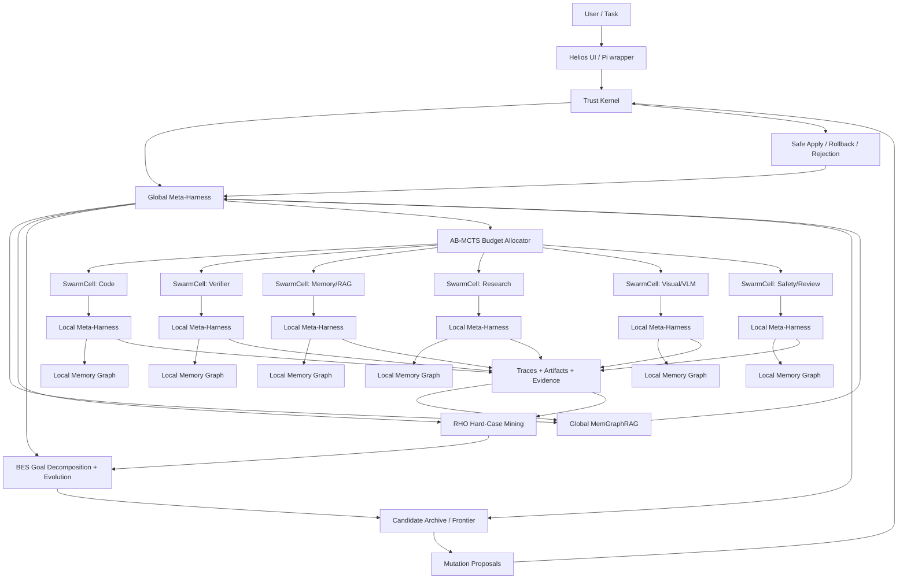
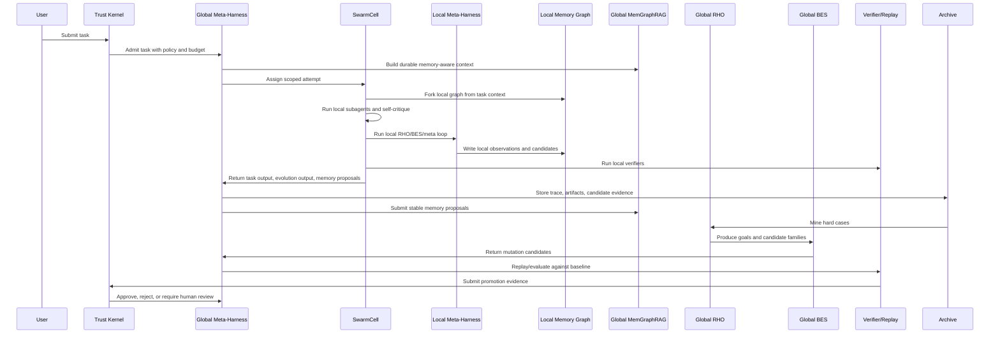

# Hierarchical Self-Modifying Swarm Synthesis

This document merges the Helios Forge architecture discussion with the remaining implementation gaps from the papers that inspired the system.

Reference papers:

- MemGraphRAG: Memory-based Multi-Agent System for Graph Retrieval-Augmented Generation, `https://arxiv.org/pdf/2606.00610`
- Meta-Harness: End-to-End Optimization of Model Harnesses, `https://arxiv.org/pdf/2603.28052`
- Retrospective Harness Optimization: Improving LLM Agents via Self-Preference over Trajectory Rollouts, `https://arxiv.org/pdf/2606.05922`
- Self-Improving Language Models with Bidirectional Evolutionary Search, `https://arxiv.org/pdf/2605.28814`

Related local docs:

- `docs/architecture/paper-implementation-alignment.md`
- `docs/architecture/feature-architecture-map.md`
- `docs/architecture/rho-bes-evolution-expansion-roadmap.md`
- `docs/superpowers/plans/2026-06-09-memgraphrag-runtime-completion.md`
- `docs/superpowers/plans/2026-06-09-hierarchical-swarm-meta-harness-implementation.md`

## Core Thesis

Helios Forge should become a hierarchical self-modifying swarm governed by a non-self-modifying trust kernel.

The system should behave like a singular mega-agent network: specialized
agents keep their own identity and evolution loops, then fuse evidence,
memory, goals, and strategy upward into a shared swarm mind. Internally it is
a recursive evolutionary stack:

```text
evolving agent
-> evolving soul
-> evolving local harness
-> evolving SwarmCell
-> evolving swarm
-> evolving oversoul
-> evolving global harness
-> evolving harness-of-harnesses
-> continuously evolving substrate
```

That stack is a swarm of swarms and a harness of harnesses:

- each agent can host local subagents;
- each agent can carry a durable `soul.md` that records identity specialization, behavior priors, memory anchors, mutation lineage, and evaluation history;
- each agent/subagent group can run its own local meta-harness;
- each local harness lets the agent evolve its own prompts, tools, skills,
  memory posture, verifier posture, communication style, and collaboration
  habits;
- each local meta-harness can maintain a local MemGraphRAG working graph;
- each local loop can propose mutations to prompts, tools, skills, local memory policy, verifier policy, routing, or source code;
- each swarm can carry an `oversoul.md` that records shared mission, role ecology, mutation policy, collective memory, fused evidence, and governance posture;
- the oversoul can coordinate a hive-mind-like shared state without erasing
  each agent's soul lineage or granting the collective self-approval power;
- all mutation evidence flows into a global meta-harness;
- all durable memory candidates flow into a global MemGraphRAG runtime;
- the global harness can evaluate many isolated harness source-tree variants as a harness-of-harnesses;
- the substrate can evolve only through evidence-backed promotions;
- durable changes pass through centralized verifier, rollback, approval, and safe-apply gates.

The concise loop:

```text
observe locally -> remember locally -> evolve locally -> report upward
-> compare globally -> replay globally -> promote safely -> update durable memory
-> update substrate -> generate the next harder evaluation frontier
```

The concise product claim:

```text
Helios Forge is a trace-driven, memory-grounded, self-improving agent harness where specialized agents evolve inside evolving harnesses, those harnesses fuse into an evolving swarm, that swarm evolves inside an evolving harness-of-harnesses, and the substrate evolves continuously without becoming self-authorizing.
```

## Implementation Snapshot

As of the June 10, 2026 recursive meta-harness capability spine, Helios has working deterministic modules and tests for the core local/global loop:

- SwarmCell output contracts normalize `taskOutput`, `evolutionOutput`, verifier evidence, and local durable-apply restrictions.
- Local meta-harnesses convert attempt hard cases into scoped local candidates and archive them without approving durable apply.
- Local memory graphs, SwarmCell graph merge, global memory promotion, guarded eight-role extraction society outputs, memory graph runtime persistence, and hierarchical memory retrieval are present.
- RHO replay batches now produce self-validation, self-consistency, self-preference, held-out variant, and candidate-family aggregate evidence.
- RHO coreset selection includes embedding-aware/DPP-style diversity metadata and deterministic fallback embeddings.
- BES lane contracts, trajectory operators, forward/backward fusion metadata, lane-specific dense verifier contracts, trajectory provenance, compatible-family descriptors, champion/frontier hooks, and global lineage records exist for harness-level candidate units.
- Global Meta-Harness experiment run storage, isolated executable candidate variant workspaces, source/config/trace/metric artifact materialization, proposer context, candidate/baseline comparison, longitudinal frontier tracking, and trust-kernel boundary checks are implemented.
- Visual evidence is promoted into sanitized benchmark cases, visual RHO seeds, memory graph references, BES policy checks, and budget-aware VLM routing recommendations.
- A2A interop has durable local inbox/outbox records, retries, progress/cancel/correlation metadata, peer discovery scaffolding, streaming envelopes, scoped delegated trust, endpoint registry records, root/symlink-safe durable state, and negotiation envelopes.
- `swarmOrchestrator.js` emits `local_meta.completed` and independently gated `local_memory.proposed` events; the sidecar full runtime wires those events into trace/UI visibility.
- The operator UI exposes Local Meta, Memory Hierarchy, BES lane status, Harness Experiments, and capability-goal status panels in the Swarm surface.

This is still a conservative harness implementation rather than a fully autonomous research reproduction. The new loops are deterministic, traceable, and approval-gated; they do not self-merge source code, mutate global tool installs, or weaken trust boundaries.

## System Shape



## Two-Level Meta-Harness

The clean architecture is not one giant meta-harness trying to understand every local detail. It is two levels of meta-harness with different scopes.

| Level | Scope | Learns from | Can evolve | Durable authority |
| --- | --- | --- | --- | --- |
| Per-agent meta-harness | One agent or SwarmCell | local attempts, local subagents, local memory graph, local verifier results | prompts, role strategy, local tool order, local context policy, local verifier hints, local subagent mix | no durable global apply |
| Global meta-harness | Whole Helios workspace | all traces, all SwarmCells, all memory proposals, RHO/BES archives, replay evidence | system routing, shared swarm profiles, shared skills, verifier configs, memory policies, source candidates | only through trust kernel |
| Trust kernel | Safety and durability boundary | promotion evidence, risk metadata, approval records | nothing automatically | yes, by policy and approval |

The rule:

```text
Local meta-harnesses improve agents tactically.
The global meta-harness improves the system strategically.
The trust kernel decides what becomes durable.
```

Local loops are allowed to revise, retry, critique, and mutate candidates inside their budget. They are not allowed to promote their own source patches, shared memory facts, verifier floors, capability grants, or approval rules.

## Local And Global MemGraphRAG

The memory hierarchy should mirror the meta-harness hierarchy.

| Layer | Purpose | Contents | Promotion rule |
| --- | --- | --- | --- |
| Agent-local memory graph | Fast working memory for one agent | observations, tool outputs, partial facts, failed paths, local subgoals, role-specific notes | direct local writes inside budget |
| SwarmCell memory graph | Shared memory inside one local swarm | merged local graphs, attempt lineage, local contradictions, champion evidence | promotes stable cell facts upward |
| Global MemGraphRAG | Durable shared memory for the whole system | stable schemas, active facts, provenance passages, cross-agent conflicts, durable lessons | global runtime adjudication and policy gates |

The memory promotion flow:

```text
local observation
-> local schema/fact/passage candidate
-> local contradiction check
-> SwarmCell merge
-> global memory proposal
-> provenance retrieval
-> conflict adjudication
-> active global fact/schema update
```

Agents may write local memory directly. Agents may propose global memory updates. Only the global memory runtime promotes durable schemas, facts, passages, graph bridges, and retrieval policies.

## SwarmCell Model

A SwarmCell is the unit that lets Helios become a swarm of swarms without turning every worker into an unbounded autonomous system.

Each SwarmCell has:

- a lead agent role;
- local subagents;
- a per-agent or per-cell meta-harness;
- a local memory graph;
- a scoped context pack;
- a scoped budget;
- allowed tools and capability grants;
- local memory/context references;
- a local verifier or evaluator;
- a local self-critique loop;
- an output contract;
- an evolution contract.

Examples:

| SwarmCell | Local subagents | Typical output |
| --- | --- | --- |
| Code | implementer, refactorer, test writer, patch minimizer | candidate patch plus verifier evidence |
| Verifier | command verifier, visual verifier, flake critic, coverage critic | verifier report or verifier-policy candidate |
| Memory/RAG | passage collector, schema proposer, fact extractor, contradiction critic, merge planner | memory graph update candidate |
| Research | source finder, citation auditor, contradiction finder, report compiler | research handoff or policy candidate |
| Visual/VLM | screenshot worker, OCR worker, layout critic, VLM judge | visual evidence and rubric candidate |
| Safety/Review | secret scanner, permission critic, rollback checker, approval classifier | risk report and promotion decision input |

Every SwarmCell returns two outputs:

```json
{
  "taskOutput": {
    "summary": "What the cell accomplished.",
    "patch": "Optional diff or artifact reference.",
    "verifierEvidence": []
  },
  "evolutionOutput": {
    "hardCaseTags": [],
    "roleWeakness": "What made the cell struggle.",
    "suggestedProfileChange": "How the role should change.",
    "suggestedSkill": "Reusable skill candidate, if any.",
    "suggestedPolicyChange": "Policy candidate, if any.",
    "suggestedCodeChange": "Harness source change, if any."
  }
}
```

The local cell can self-critique and revise within budget. It cannot promote its own changes.

Each SwarmCell runs the full evolution loop locally:

```text
attempt -> local trace -> local memory update -> local RHO hard-case tag
-> local BES mutation -> local replay/critique -> local candidate proposal
-> global meta-harness submission
```

The global meta-harness then runs the same pattern across cells:

```text
all local proposals -> global coreset -> grouped replay
-> self-validation/self-consistency -> BES recombination
-> frontier comparison -> trust-kernel promotion decision
```

## Evolutionary Loops

The word "evolution" is overloaded in this system, so the loops are separated by authority, input evidence, and promotion path.

### 1. SwarmCell Task Loop

This is the innermost execution loop. A SwarmCell receives a scoped task, role profile, context pack, budget, and output contract. It runs an attempt through one of the existing worker paths: deterministic subagent, command-backed subagent, worktree command attempt, model-driven worker, or Pi-native worker.

Output:

- `taskOutput`: the actual task result, patch, summary, artifacts, and verifier evidence;
- `evolutionOutput`: hard-case tags, role weaknesses, suggested profile/tool/verifier/memory/source changes, and memory proposals.

Authority:

- may complete the task;
- may propose local/global improvements;
- may not approve durable apply.

### 2. Local Meta-Harness Loop

This loop runs inside or beside a SwarmCell after an attempt. It reads `evolutionOutput`, verifier evidence, attempt status, and local hard-case tags. It converts those signals into local candidates such as prompt/profile changes, verifier hints, memory-policy suggestions, code-change suggestions, or memory proposals.

Runtime shape:

```text
attempt result -> local hard-case tags -> local candidate
-> local promotion blocker -> local candidate archive
-> local_meta.completed event
```

Authority:

- may archive scoped candidates under `.harness/meta/local-candidates/`;
- may mark candidates as forwardable to global review;
- must set `durableApplyApproved: false`.

### 3. Local Memory And SwarmCell Memory Loop

This loop is the speculative memory layer. Agents and SwarmCells can collect observations quickly without making them durable global truth.

Runtime shape:

```text
local observation -> local graph fact/passage
-> SwarmCell graph merge -> duplicate/support check
-> local_memory.proposed event
-> global memory proposal
```

Authority:

- local memory can be written directly inside the attempt budget;
- SwarmCell memory can merge and summarize local facts;
- global memory remains pending until promoted by the global runtime.

The `localMemoryGraph` flag is independent of `localMetaHarness`. Attempt-level `evolutionOutput.memoryProposals` still emit `local_memory.proposed` even when local meta feedback is disabled.

### 4. Global MemGraphRAG Promotion Loop

This is the durable memory loop. It separates passages, schemas, and facts so unstable claims do not pollute global retrieval.

Runtime shape:

```text
pending passages/schemas/facts
-> schema stability check
-> conflict classification
-> provenance and graph construction
-> active global layer update
-> hierarchical retrieval context
```

Authority:

- may promote stable memory into global layers;
- may construct durable memory-guided graph snapshots;
- must preserve provenance and conflict metadata.

### 5. RHO Replay Loop

RHO decides what the system should learn from. It mines hard cases from traces, swarm outcomes, verifier failures, visual failures, memory/RAG failures, and other runtime evidence. It then runs grouped baseline/candidate replay and scores the results.

Runtime shape:

```text
trace archive -> hard-case coreset
-> grouped baseline/candidate rollouts
-> self-validation
-> self-consistency
-> self-preference evidence
```

Authority:

- selects training/evaluation curriculum for harness evolution;
- creates promotion evidence;
- does not promote changes by itself.

### 6. BES Candidate Evolution Loop

BES generates and refines candidate changes. In Helios this is harness-level BES, not model-weight training. Each lane declares a candidate unit, verifier unit, mutation operators, recombination policy, and promotion rule.

Runtime shape:

```text
backward goal tree -> forward candidate mutation
-> dense subgoal verification
-> recombination / crossover / deletion / translocation
-> lineage record -> candidate archive
```

Example lanes:

- code patches;
- verifier genomes;
- memory graph policies;
- research policies;
- skills;
- swarm role/profile strategies.

Authority:

- can produce candidate families and lineage;
- can score partial progress;
- cannot bypass promotion policy or approval.

### 7. Global Meta-Harness Experiment Loop

This is the loop closest to the Meta-Harness paper. It stores candidate source/config patches, local summaries, memory proposals, traces, evals, promotion evidence, rollback metadata, and frontier comparisons in a run directory.

Runtime shape:

```text
candidate proposal -> harness run directory
-> baseline replay
-> candidate replay
-> pairwise preference / metrics
-> frontier update
-> promotion decision
```

Authority:

- may rank candidates on quality, safety, cost, latency, reliability, and maintainability;
- may write promotion evidence;
- may not self-apply source patches.

### 8. AB-MCTS Adaptive Search Loop

AB-MCTS is the online budget allocator. It is not the meta-harness itself. It chooses how to spend the next unit of effort: go wider, go deeper, switch worker/profile, gather more evidence, or stop/promote.

Runtime shape:

```text
current task state -> selected arm
-> runtime action
-> reward from champion/verifier/cost
-> scheduler summary
-> next selected arm
```

Authority:

- advisory runtime allocation;
- replayable from traces;
- no apply or promotion power.

### 9. Trust-Kernel Promotion Loop

This is not an evolutionary loop. It is the non-self-modifying boundary around the evolutionary loops.

Runtime shape:

```text
candidate + evidence + risk metadata
-> workspace/path/verifier/audit/secret/approval checks
-> approve, reject, or require human review
-> safe apply / rollback record if approved
```

Authority:

- owns durable mutation decisions;
- rejects verifier-floor weakening, audit disablement, secret-redaction disablement, missing source-patch paths, and out-of-workspace writes;
- keeps the swarm self-improving but not self-authorizing.

## Trust Kernel

The trust kernel is intentionally not part of the self-modifying swarm.

It owns:

- workspace path containment;
- secret handling and redaction;
- shell and MCP write-scope rules;
- budget hard stops;
- verifier minimums;
- rollback requirements;
- approval tiers;
- audit logging;
- branch/worktree mutation rules;
- safe apply;
- global capability install boundaries.

The swarm may propose changes to the trust kernel, but those changes must stay human-required until there is a separate trusted release process. This keeps the system self-modifying without making it self-authorizing.

## Autonomy Tiers

| Tier | Name | What can change automatically | Promotion rule |
| --- | --- | --- | --- |
| 0 | Shadow only | Candidates, traces, evals, reports | Never applies |
| 1 | Local policy evolution | prompts, routing weights, context budgets, memory thresholds, non-mutating skill drafts | auto-eligible only if reversible, local, tested, and rollback-backed |
| 2 | Workspace-local capability evolution | generated skills, verifier configs, memory graph policies, swarm profiles | approval-gated apply into `.harness` |
| 3 | Self-modifying source patches | Helios source changes in isolated branches/worktrees | verifier/replay/rollback plus human approval |
| 4 | Self-merging source patches | narrow low-risk source changes after soak testing | future only, disabled by default |
| 5 | Trust-kernel mutation | approval, sandbox, secrets, rollback, verifier floor changes | human-required release process |

The near-term target is Tier 3: self-modifying in isolated worktrees, approval-gated before durable apply.

## How The Four Papers Fit

The target is not merely to borrow motifs from the papers. The target is to close the remaining gaps by assigning each missing capability to the correct layer:

| Paper gap | Local layer | Global layer |
| --- | --- | --- |
| MemGraphRAG extraction society | local passage/schema/fact agents inside each SwarmCell | global memory runtime, provenance retrieval, conflict adjudication, hierarchical retrieval |
| Meta-Harness code-space search | per-agent harness variants, prompt/tool/context candidates, local replay | global experiment directories, source patches, Pareto frontier, held-out replay |
| RHO retrospective optimization | local hard-case tagging and rerolls | global difficulty-diverse coreset, group rollouts, self-validation, self-consistency, pairwise self-preference |
| BES bidirectional search | local subgoal trees, mutation, recombination, dense scoring | cross-cell recombination, lineage tracking, candidate family evolution, global verifier feedback |

This turns the research inspirations into one continuous evolution loop:

```text
local trace -> local memory/meta evolution -> global trace archive
-> global memory/meta evolution -> trust-gated durable change
-> next local trace
```

### MemGraphRAG

Role in Helios:

MemGraphRAG is the shared memory and graph-construction substrate. It lets the swarm remember across runs without relying on isolated chunk extraction.

What Helios has:

- schema/fact/passage memory layers;
- pending-to-active fact promotion;
- conflict classification and deterministic adjudication;
- guarded extraction society role pipeline;
- memory-guided graph construction;
- memory-aware graph retrieval;
- graph snapshot support;
- local memory graph and SwarmCell memory graph merge;
- global memory promotion proposals;
- deterministic extraction society scaffold;
- memory graph runtime persistence/loading;
- hierarchical memory retriever.

What remains:

- production model-assisted extraction society roles using the current guarded role-output contract;
- broader production persistence, migration, and eval coverage for global layers;
- deeper provenance retrieval and model-assisted conflict adjudication under explicit policy gates;
- deeper task-context integration and retrieval policy tuning;
- larger memory graph eval suites and decay/consolidation drills;
- RHO/BES/adaptive tuning of graph policies.

Design synthesis:

The Memory/RAG SwarmCell should be the first real nested swarm. It should run sidecar-local subagents initially:

```text
passage_collector -> schema_proposer -> fact_extractor
-> contradiction_critic -> merge_planner -> graph_constructor
-> hierarchical_retriever -> graph_eval
```

To close the paper gap, this must exist at two levels:

- local extraction societies inside SwarmCells;
- a global memory runtime that persists layers, retrieves provenance, adjudicates conflicts, builds the global graph, and serves hierarchical retrieval to future tasks.

Do not make these networked A2A agents until durable A2A transport exists.

### Meta-Harness

Role in Helios:

Meta-Harness is the outer loop that treats harness behavior as something to optimize, not hand-design forever.

What Helios has:

- traces and artifacts;
- candidate archive;
- frontier store;
- harness run store;
- harness experiment runner;
- isolated harness variant workspaces;
- candidate runner;
- promotion loop;
- longitudinal benchmark frontier tracking;
- policy evolution modules;
- change proposals;
- safe apply and approval resume;
- generated skill lifecycle.

What remains:

- autonomous full-source candidate harness variants beyond the current deterministic source/config/trace/metric workspaces;
- repeated propose-evaluate-log loops over many candidates;
- stable production-sized benchmark and held-out task suites;
- richer operator-facing Pareto frontier over quality, safety, reliability, cost, latency, maintainability, visual confidence, memory health, and trust risk;
- proposer access to uncompressed prior traces and candidate source.

Design synthesis:

Every local meta-harness may create candidate variants, but every proposed durable mutation should become a first-class global harness experiment:

```text
.harness/meta/harness-runs/<run-id>/
  candidate.json
  local-agent-summary.json
  source.patch
  config.patch
  traces/
  artifacts/
  evals.json
  promotion.json
  rollback.json
```

This makes the self-modifying swarm auditable and replayable.

To close the paper gap, the global meta-harness needs a filesystem interface that exposes candidate source, config, raw traces, scores, replay evidence, local agent summaries, and rejected alternatives. Local meta-harnesses should write compact candidate records; the global meta-harness should own the full experiment run.

### RHO

Role in Helios:

RHO decides what the swarm should learn from.

What Helios has:

- coreset builder;
- embedding-aware/DPP-style diversity metadata for case selection;
- replay batch runner;
- self-validation scoring;
- self-consistency scoring;
- self-preference evidence;
- hard-case categories for verifier, visual, memory/RAG, swarm, compaction, tool loop, MCP, and research failures;
- swarm outcome feedback;
- skill need mining;
- meta optimizer inputs;
- trace replay and adaptive-search replay.
- aggregate candidate-family replay evidence.

What remains:

- production embeddings or richer learned similarity instead of fixture-level/precomputed/fallback vectors;
- larger grouped rerolls over selected production held-out tasks;
- model-assisted trajectory ranking beyond deterministic self-validation and self-consistency;
- broader candidate-family-vs-baseline replay across more families;
- stronger self-validation, self-consistency, and self-preference weight in promotion signals without bypassing policy gates.

Design synthesis:

RHO should become the learning curriculum for the whole mega-network:

```text
local traces -> local hard-case tags -> global hard-case coreset
-> grouped swarm rerolls -> self-validation/self-consistency
-> candidate proposal -> baseline-vs-candidate replay
-> self-preference evidence -> promotion evidence
```

To close the paper gap, local meta-harnesses should produce difficulty and failure metadata, while the global RHO runner should select a diverse cross-agent coreset, run grouped replays, and compare baseline/candidate rollouts by pairwise self-preference before promotion.

### BES

Role in Helios:

BES is the search engine for escaping local prompt/rollout habits.

What Helios has:

- subgoal planning and scoring;
- backward goal trees;
- bidirectional search loop;
- mutation and recombination;
- lane contracts for code, verifier, memory, research, skill, and swarm;
- trajectory operators;
- lane-specific dense subgoal verifier metadata;
- trajectory provenance;
- global lineage tracker;
- champion archive/frontier evidence bridge;
- population/island/archive evolution;
- evolution-aware swarm planning;
- evolution-aware swarm budget allocation;
- AB-MCTS-style online allocation adjacent to BES.

What remains:

- paper-grade trajectory-level expansion, deletion, translocation, crossover, and recombination semantics across all lanes;
- stronger learned or model-assisted dense subgoal verifiers;
- fully fused forward/backward runtime search in every lane, beyond the current metadata/contracts;
- stronger lineage across evolved prompts, policies, code patches, skills, verifier genomes, and memory graph policies.

Design synthesis:

BES should operate on SwarmCell candidate units:

| Lane | Candidate unit | Backward goal | Forward mutation |
| --- | --- | --- | --- |
| Code | patch attempt | tests, changed files, risk limits | recombine patches, minimize diff, split task |
| Verifier | verifier genome | catch failure without new flakes | mutate command/rubric/threshold |
| Memory | graph policy | higher evidence coverage, fewer conflicts | tune schema thresholds, conflict policy |
| Research | report policy | more supported claims, fewer contradictions | change source ranking, claim audit |
| Skill | `SKILL.md` candidate | trigger precision and task lift | rewrite trigger/workflow/safety |
| Swarm | role/profile strategy | better champion score at lower cost | mutate role mix, budgets, model profile |

To close the paper gap, BES must run at both levels. Local BES mutates agent trajectories, subgoal plans, prompts, role mixes, and local graph policies. Global BES recombines successful local candidates across SwarmCells, tracks lineage, and sends only verifier-backed candidates to the global frontier.

## A2A Role

A2A is the future transport for independent SwarmCells and subagents. Today Helios has durable local A2A contracts and endpoint metadata, but not a complete peer-to-peer swarm network.

Current behavior:

- sidecar assigns attempts;
- Pi-native workers receive A2A-style envelopes;
- external agent gateway can redact, route, and gate mutation;
- durable local inbox/outbox records preserve correlation, parent/root lineage, progress, cancel, retry, and stream state metadata;
- scoped delegated tokens and stable issuer-secret providers are supported locally;
- peer discovery, endpoint registry records, negotiation envelopes, root-constrained durable stores, and streaming envelopes exist as local contracts;
- mutation requires approval and delegated tokens.

Missing for a true mega-network:

- persistent A2A endpoints per agent;
- production queue backends wired to real service lifecycles beyond the local JSON durable-store adapter;
- external server/client transports that exercise peer discovery, bidirectional streaming, retries, cancellation, and progress over real network flows;
- production delegated-token issuer secret management;
- shared task-state sync;
- subagent-to-subagent delegation and negotiation;
- multi-hop lineage through real external agent flows.

Near-term rule:

Use sidecar-local SwarmCells until the external A2A transport is durable. Treat A2A endpoint, negotiation, and streaming envelopes as contracts, not as proof that peer networking is complete.

## New Runtime Loop

The intended runtime loop for a self-modifying swarm:



## Original Workstreams And Remaining Gaps

The following workstreams were the original module-level implementation targets. The current recursive meta-harness capability spine has implemented deterministic sidecar-local versions of items 1 through 7, most local A2A durability contracts from item 8, and trust-kernel/operator visibility coverage from item 9. Remaining gaps are mostly scale, model-assisted judgment, autonomous source-tree search, external A2A transport, production dashboards, and production hardening rather than missing skeleton modules.

### 1. SwarmCell Runtime

Add first-class SwarmCell records:

```js
{
  cellId,
  role,
  localAgents,
  allowedTools,
  contextPolicy,
  budgetPolicy,
  verifierPolicy,
  mutationPolicy,
  outputContract,
  evolutionContract
}
```

Needed modules:

- `src/harness-sidecar/swarm/swarmCellRuntime.js`
- `src/harness-sidecar/swarm/swarmCellRegistry.js`
- `src/harness-sidecar/swarm/swarmCellContracts.js`

### 2. Per-Agent Meta-Harness Runtime

Add a local meta-harness inside each agent or SwarmCell.

Needed modules:

- `src/harness-sidecar/meta/localMetaHarness.js`
- `src/harness-sidecar/meta/localCandidateArchive.js`
- `src/harness-sidecar/meta/localEvolutionLoop.js`
- `src/harness-sidecar/meta/localPromotionBlocker.js`

Required behavior:

- collect local traces, failures, verifier evidence, and local memory updates;
- run local hard-case tagging;
- run local BES mutation and recombination over scoped candidate units;
- emit local candidate records;
- block durable apply and forward all durable proposals to the global meta-harness.

### 3. Local And Global MemGraphRAG Runtime

Split memory graph operation into local and global layers.

Needed modules:

- `src/harness-sidecar/memory/localMemoryGraph.js`
- `src/harness-sidecar/memory/swarmCellMemoryGraph.js`
- `src/harness-sidecar/memory/globalMemoryPromotion.js`
- `src/harness-sidecar/memory/memoryExtractionSociety.js`
- `src/harness-sidecar/memory/memoryGraphRuntime.js`
- `src/harness-sidecar/rag/hierarchicalMemoryRetriever.js`
- `src/harness-sidecar/memory/memoryEvals.js`

Required behavior:

- local graphs accept fast speculative observations;
- SwarmCell graphs merge local agent memory with local contradiction checks;
- global promotion retrieves provenance and adjudicates conflicts;
- global graph updates only through policy-gated promotion;
- global retrieval returns schema, active fact, passage, bridge, and summary context.

### 4. Evolution Output Contract

Every subagent and SwarmCell should emit an evolution output alongside task output.

Needed changes:

- extend `src/harness-sidecar/swarm/subagentRunner.js`;
- extend `src/harness-sidecar/swarm/modelDrivenWorker.js`;
- extend `src/harness-sidecar/swarm/piNativeWorker.js`;
- extend compact handoff scoring to include evolution evidence.

### 5. Harness Experiment Runs

Create a Meta-Harness-style experiment store.

Needed modules:

- `src/harness-sidecar/meta/harnessRunStore.js`
- `src/harness-sidecar/meta/harnessExperimentRunner.js`
- `src/harness-sidecar/meta/harnessVariantWorkspace.js`
- `src/harness-sidecar/meta/harnessFrontier.js`
- `src/harness-sidecar/meta/longitudinalFrontier.js`

Each run should store local agent summaries, memory proposals, baseline replay, candidate replay, self-preference evidence, source/config patches, verifier evidence, risk metadata, and rollback data.

### 6. RHO Replay Batch Runner

Add grouped rerolls and self-preference evidence.

Needed modules:

- `src/harness-sidecar/rho/replayBatchRunner.js`
- `src/harness-sidecar/rho/selfValidation.js`
- `src/harness-sidecar/rho/selfConsistency.js`
- `src/harness-sidecar/rho/selfPreferenceJudge.js`

### 7. BES Full-Lane Evolution Contracts

Make all lanes declare their candidate units, mutation operators, recombination operators, dense subgoal verifier, archive policy, and global promotion rule.

Needed modules:

- `src/harness-sidecar/bes/laneContracts.js`
- `src/harness-sidecar/bes/trajectoryOperators.js`
- `src/harness-sidecar/bes/denseSubgoalVerifier.js`
- `src/harness-sidecar/bes/globalLineageTracker.js`

### 8. A2A Durable Transport

Only after SwarmCell runtime is useful locally:

- `src/harness-sidecar/interop/a2aServer.js`
- `src/harness-sidecar/interop/a2aClient.js`
- `src/harness-sidecar/interop/a2aInbox.js`
- `src/harness-sidecar/interop/a2aEndpointRegistry.js`
- `src/harness-sidecar/interop/a2aTaskSync.js`

### 9. Trust Kernel Boundary Tests

Add tests proving the swarm cannot self-authorize:

- cannot weaken verifier floor;
- cannot disable audit;
- cannot expand MCP write scope without approval;
- cannot write outside workspace;
- cannot mutate global Pi/Codex/Claude installs;
- cannot auto-merge source patches by default;
- cannot bypass rollback metadata.

## Next Implementation Order

Recommended next sequence:

1. Lock stable production-sized held-out benchmark suites and run repeated longitudinal cycles.
2. Upgrade Meta-Harness variants from deterministic isolated workspaces to autonomous full source-tree candidates with raw trace and source access for the proposer.
3. Replace fixture/precomputed RHO similarity with production embeddings or learned similarity and run larger grouped rerolls over candidate families.
4. Promote MemGraphRAG extraction society roles from guarded deterministic outputs to guarded model-assisted workers with migration, decay/consolidation, and larger eval suites.
5. Deepen BES lanes with true runtime forward/backward fusion, learned dense verifiers, compatible-family mutation/recombination, and champion archives connected to production dashboards.
6. Scale multimodal into OCR/PDF/diagram/chart/UI regression suites, a dedicated visual SwarmCell, visual RHO cases, visual policy evolution, and budget-aware VLM routing.
7. Build external A2A server/client transports, production queue stores, subagent-to-subagent negotiation, and multi-hop lineage over real network flows.
8. Expand governance dashboards for scheduled replay jobs, rollback drills, budget-aware improvement accounting, trust-risk trends, autonomy levels, and audit overrides.

This order keeps the system measurable at every step and avoids increasing autonomy before the benchmark frontier and trust evidence can catch regressions.

## Acceptance Criteria

The local architecture is working when:

- every task writes trace, memory, verifier, swarm, and promotion evidence;
- every SwarmCell returns both task output and evolution output;
- every SwarmCell has a local meta-harness loop and local memory graph;
- local memory updates remain speculative until promoted;
- global MemGraphRAG adjudicates durable schemas, facts, passages, bridges, and retrieval policy;
- hard cases are mined from real trace failures;
- local and global RHO loops distinguish tactical failures from cross-agent hard cases;
- BES produces candidate mutations with lineage and dense subgoal scores;
- local BES runs inside SwarmCells and global BES recombines across SwarmCells;
- Meta-Harness experiment runs store candidate patches/configs/traces/evals/local summaries/memory proposals;
- RHO replay batches compare baseline and candidate behavior;
- pairwise self-preference is recorded as promotion evidence, not automatic authority;
- source-code mutations happen only in isolated worktrees;
- durable apply requires verifier evidence, rollback, and approval policy;
- the trust kernel remains outside the self-modifying loop.

The remaining paper-grade target is working when:

- benchmark suites are stable enough to compare weeks of repeated runs;
- candidate harness variants are evaluated as autonomous source-tree candidates and retain source/config/trace/metric artifacts;
- RHO rerolls cover large held-out suites and candidate families with meaningful self-preference evidence;
- MemGraphRAG model-assisted roles improve graph retrieval while preserving provenance and conflict policy;
- BES lanes show measurable lift from forward/backward fusion and compatible-family recombination;
- visual benchmark suites and visual RHO cases affect promotion/blocking decisions;
- external A2A flows survive restarts, retries, streaming, delegated trust, and multi-hop lineage;
- governance dashboards expose quality, safety, reliability, cost, latency, maintainability, visual confidence, memory health, trust risk, rollback, and autonomy-state trends.

## Bottom Line

The merged architecture is:

```text
A hierarchical, memory-grounded, self-modifying swarm network
that learns locally and globally through MemGraphRAG, BES, RHO, and Meta-Harness loops,
and remains governed by a non-self-modifying trust kernel.
```

This is the clean way to make Helios behave like a singular mega-agent while preserving enough structure to debug it, test it, and stop it from rewriting the rules that keep it safe.
