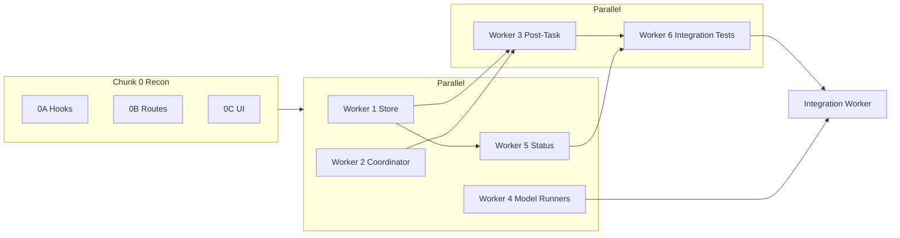

# ICR Wiring — Parallel Subagent Implementation Plan

> **For agentic workers:** REQUIRED: Use superpowers:subagent-driven-development (if subagents available) or superpowers:executing-plans to implement this plan. Steps use checkbox (`- [ ]`) syntax for tracking.

**Goal:** Wire the existing ICR evidence-only substrate (Tasks 1–7, 9–10 of `2026-06-12-icr-test-time-compute-lane.md`) into the production sidecar hot path, persistence layer, evidence API, and operator dashboard — without real model calls by default and without claiming production proof.

**Architecture:** Add disjoint modules under `src/harness-sidecar/icr/` for persistence, orchestration, post-task hooks, status assembly, and optional guarded model runners. Parallel workers own separate files + tests. A **serial Integration Worker** wires `server.js`, `harnessManager.js`, `configLoader.js`, and `public/app.js` after domain workers are green. ICR remains `evidenceOnly: true`, `promotionAllowed: false`, and gated by `icr.enabled: false` until operator opt-in.

**Parent plan:** `docs/superpowers/plans/2026-06-12-icr-test-time-compute-lane.md` (substrate complete; Task 8 open)

**Tech Stack:** Node.js ESM, `node:test`, existing ICR modules, BES/RHO adapters, `.harness/icr/` JSON artifacts, sidecar evidence routes, `capabilityGoalStatus.js`, `public/app.js` harness panel.

---

## Current Baseline (June 17, 2026)

| Area | Status |
| --- | --- |
| ICR core (`icrContracts` … `icrReplayAdapter`) | **Done** — 47 focused tests pass |
| BES `icr` lane + capability goal `icr_test_time_compute` | **Done** — library-level only |
| Config `icr.enabled: false` | **Done** |
| Sidecar routes / post-task hook / persistence | **Not started** |
| UI surfacing beyond generic capability rows | **Not started** |
| Real model runners | **Not started** (optional Worker 4; off by default) |
| Production replay proof at scale | **Out of scope** — remains gated |

---

## Controller Responsibilities

1. Confirm substrate tests green: `node --test tests/harness-icr-*.test.js`
2. Run **Chunk 0** recon subagents in parallel (read-only).
3. Dispatch **Workers 1–5 in parallel** (disjoint write scopes).
4. After each worker: **spec reviewer**, then **code quality reviewer**.
5. Dispatch **Worker 6 (integration tests)** after Workers 1–3 export stable APIs.
6. Dispatch **serial Integration Worker** only after Workers 1–6 are approved.
7. Run `npm test` and `npm run release:smoke` before merge.
8. Update checkboxes in this plan and add a short addendum to the parent ICR plan Task 8 section.

---

## Subagent Dispatch Protocol

### Implementer prompt prefix

```text
You are implementing one worker from:
docs/superpowers/plans/2026-06-17-icr-wiring-parallel-subagents.md

Worker ID: [WORKER_ID]

You are not alone in this codebase. Other workers may edit other files in parallel.
Do not revert or rewrite unrelated changes. Work only in your assigned files/modules.
Follow existing Helios Forge patterns. Preserve evidence-only authority.
Use TDD: write failing tests first, then implementation, then focused verification.

Assigned files (ONLY these):
[FILE_LIST]

Non-negotiable:
- evidenceOnly: true and promotionAllowed: false on all ICR persisted records
- canPromote: false on evidence API responses
- No real model/provider calls unless Worker 4 scope AND icr.useModelRunners is explicitly true in test
- Default path uses injected deterministic fake runners (same as existing ICR tests)
- All dashboard-visible fields pass through sanitizeIcrEvidenceForDashboard
- Workspace-root-constrained paths only under .harness/icr/

Return exactly:
- status: DONE | DONE_WITH_CONCERNS | NEEDS_CONTEXT | BLOCKED
- changed files
- tests run (command + result)
- remaining concerns
```

### Shared integration chokepoints (serial only)

**Only the Integration Worker may edit:**

- `src/harness-sidecar/server.js`
- `src/harness/harnessManager.js`
- `src/server.js` (if main server proxies harness evidence refresh)
- `public/app.js`
- `public/index.html` (only if new DOM ids required)
- `src/harness-sidecar/config/configLoader.js`
- `docs/superpowers/plans/2026-06-12-icr-test-time-compute-lane.md` (Task 8 checkbox updates only)
- this plan file

---

## Chunk 0: Recon (Parallel, Read-Only)

### Agent 0A: Post-Task Hook Points

**Read:** `src/harness-sidecar/meta/recursiveEvolutionRuntimeHook.js`, `backgroundEvolutionWorker.js`, `server.js` (task completion / `runFullRuntimeSubsystems`).

**Return:** exact function(s) to call `runPostTaskIcrHooks` from; existing `emitEvent` patterns; whether to chain inside `runPostTaskRecursiveEvolutionHooks` or parallel sibling hook.

### Agent 0B: Evidence Route Patterns

**Read:** `server.js` (`getProductionEvidence`, `evidenceRoutes` map, `productionEvidenceResponse`).

**Return:** recommended route key (`icrStatus`), gate name (`icr` or new `productionCapabilities.icrLane`), `.harness/icr/` subdirectory layout.

### Agent 0C: Dashboard / Capability Flow

**Read:** `capabilityGoalStatus.js` (`summarizeCapabilityGoalStatus`, `icrEvidence` param), `harnessManager.js`, `public/app.js` (`renderCapabilityGoalRows`, `PRODUCTION_EVIDENCE_TYPES`).

**Return:** minimal UI diff to show ICR blockers + `icrDashboardRows`; whether capability goals auto-update when `icrEvidence` is loaded from disk.

---

## Parallel Workers (Disjoint Scopes)

### Worker 1: ICR Evidence Store

**Files:**
- Create: `src/harness-sidecar/icr/icrEvidenceStore.js`
- Create: `tests/harness-icr-evidence-store.test.js`

**Checklist:**

- [ ] Write failing tests for persist/load round-trip, workspace boundary, and evidence-only enforcement.
- [ ] Implement `icrStorePaths(workspaceRoot)` → `{ familiesDir, rhoReportsDir, latestIndex }`.
- [ ] Implement `persistIcrCandidateFamily(workspaceRoot, record)` → sanitized JSON under `.harness/icr/families/`.
- [ ] Implement `persistIcrRhoReport(workspaceRoot, report)` → `.harness/icr/rho-reports/`.
- [ ] Implement `loadRecentIcrEvidence(workspaceRoot, { limit })` → `{ families, rhoReports }`.
- [ ] Implement `loadIcrEvidenceForCapabilityGoals(workspaceRoot, config)` → array for `summarizeCapabilityGoalStatus({ icrEvidence })`.
- [ ] Strip `promotionAllowed`, secrets, and judge-forbidden fields before write (reuse `sanitizeIcrEvidenceForDashboard` where appropriate).
- [ ] Update `latest-index.json` with taskId, timestamps, artifact paths (no promotion fields).

**Acceptance:**

- [ ] `node --test tests/harness-icr-evidence-store.test.js` passes.
- [ ] ENOENT returns empty arrays, not throws.
- [ ] Paths cannot escape workspace root.

---

### Worker 2: ICR Runtime Coordinator

**Files:**
- Create: `src/harness-sidecar/icr/icrRuntimeCoordinator.js`
- Create: `tests/harness-icr-runtime-coordinator.test.js`

**Checklist:**

- [ ] Write failing tests for disabled lane (no-op), enabled lane with fake runners, and RHO comparison optional flag.
- [ ] Implement `icrLaneEnabled(harnessConfig)` — true when `harnessConfig.icr?.enabled === true`.
- [ ] Implement `runIcrLaneForTask({ task, harnessConfig, runners, now, includeRhoComparison, rhoRunner })`.
- [ ] Call `runIcrCandidateFamily` with `normalizeIcrConfig(harnessConfig.icr)`.
- [ ] Optionally call `runIcrRhoReplayComparison` when `includeRhoComparison: true`.
- [ ] Return `{ skipped, reason?, family, rhoReport?, evidenceOnly: true, promotionAllowed: false }`.
- [ ] Export `createDeterministicIcrRunners(fixture)` for tests (mirror patterns from `harness-icr-candidate-family.test.js`).

**Acceptance:**

- [ ] `node --test tests/harness-icr-runtime-coordinator.test.js` passes.
- [ ] Disabled config returns `{ skipped: true }` without side effects.
- [ ] No filesystem writes in this module (Worker 3 composes with store).

---

### Worker 3: Post-Task Hook

**Files:**
- Create: `src/harness-sidecar/icr/icrPostTaskHook.js`
- Create: `tests/harness-icr-post-task-hook.test.js`

**Depends on:** Worker 1 + 2 APIs stable (can mock in tests initially).

**Checklist:**

- [ ] Write failing tests: hook skipped when disabled; persists family + optional rho when enabled; emits event.
- [ ] Implement `runPostTaskIcrHooks({ workspaceRoot, harnessConfig, task, emitEvent, runners, now })`.
- [ ] Gate on `icrLaneEnabled(harnessConfig)`.
- [ ] Call `runIcrLaneForTask`, then `persistIcrCandidateFamily` / `persistIcrRhoReport`.
- [ ] Emit `icr.lane_completed` with sanitized summary (branch count, cost gate status, rho uplift headline).
- [ ] Return `{ ran, artifacts, capabilityInputs }` for integration worker.

**Acceptance:**

- [ ] `node --test tests/harness-icr-post-task-hook.test.js` passes.
- [ ] Temp workspace tests prove JSON files land under `.harness/icr/`.
- [ ] Event payload contains no branch memory / critique / PQF internals.

---

### Worker 4: Guarded Model Runners (Optional, Off by Default)

**Files:**
- Create: `src/harness-sidecar/icr/icrModelRunners.js`
- Create: `tests/harness-icr-model-runners.test.js`

**Checklist:**

- [ ] Write failing tests: default returns fake runners; `useModelRunners: true` builds provider-backed runners with quarantine.
- [ ] Implement `createIcrRunners({ harnessConfig, modelProvider, fakeRunners })`.
- [ ] Require **both** `icr.useModelRunners === true` and `productionCapabilities.icrLane?.enabled === true` for real calls.
- [ ] Route all model output through existing redaction / `modelVisibleQuarantine` patterns.
- [ ] Document in module header: not used in default tests or startup.

**Acceptance:**

- [ ] `node --test tests/harness-icr-model-runners.test.js` passes.
- [ ] Tests use injected fake provider only; no network.

**Note:** If blocked on provider wiring, return `DONE_WITH_CONCERNS` — Integration Worker falls back to deterministic runners only.

---

### Worker 5: Status / Evidence Assembler

**Files:**
- Create: `src/harness-sidecar/icr/icrStatusHandler.js`
- Create: `tests/harness-icr-status-handler.test.js`

**Depends on:** Worker 1 `loadRecentIcrEvidence`.

**Checklist:**

- [ ] Write failing tests for empty store, populated store, and gate-off behavior.
- [ ] Implement `buildIcrEvidenceStatus({ workspaceRoot, harnessConfig })` matching `productionEvidenceResponse` shape:
  - `type: 'icrStatus'`, `evidenceOnly: true`, `canPromote: false`
  - `gate: { name: 'icrLane', enabled, mode, authority: 'evidence_only' }`
  - `summary: { itemCount, available, latestTaskId, costGateStatus, rhoRegressionCount }`
  - `items: [...]` sanitized families/reports
- [ ] Implement `buildIcrHarnessCapabilityInputs({ workspaceRoot, harnessConfig })` → `{ icrEvidence, icrConfig }`.

**Acceptance:**

- [ ] `node --test tests/harness-icr-status-handler.test.js` passes.
- [ ] Output safe for direct JSON HTTP response.

---

### Worker 6: Sidecar Integration Tests (Pre-Wiring)

**Files:**
- Create: `tests/harness-icr-sidecar-integration.test.js`

**Depends on:** Workers 1–3, 5 (import modules directly; no `server.js` edits yet).

**Checklist:**

- [ ] Test end-to-end: temp workspace → `runPostTaskIcrHooks` → disk → `buildIcrEvidenceStatus` → `summarizeCapabilityGoalStatus`.
- [ ] Assert `icr_test_time_compute` goal shows expected blockers before rho report present.
- [ ] Assert `level4ReadyCandidate` stays false without production replay evidence.
- [ ] Assert capability `icrDashboardRows` populated when family exists.

**Acceptance:**

- [ ] `node --test tests/harness-icr-sidecar-integration.test.js` passes.

---

## Serial Integration Worker

**Run only after Workers 1–6 approved.**

### Task I1: Config

**Modify:** `src/harness-sidecar/config/configLoader.js`, `tests/harness-config.test.js`

- [ ] Extend `icr` defaults:
  ```js
  icr: {
    enabled: false,
    mode: 'evidence_only',
    persistOnTask: true,
    includeRhoComparison: false,
    useModelRunners: false,
  }
  ```
- [ ] Add `productionCapabilities.icrLane: { enabled: false, mode: 'offline', authority: 'evidence_only' }`.
- [ ] Tests for YAML override of `icr.enabled` and `icrLane`.

### Task I2: Sidecar Server

**Modify:** `src/harness-sidecar/server.js`

- [ ] Import `runPostTaskIcrHooks`, `buildIcrEvidenceStatus`, `buildIcrHarnessCapabilityInputs`.
- [ ] Call `runPostTaskIcrHooks` from post-task completion path (location from Agent 0A).
- [ ] Add `/v1/evidence/icr-status` → `evidenceRoutes` map key `icrStatus`.
- [ ] Extend `getProductionEvidence('icrStatus')` to call `buildIcrEvidenceStatus`.
- [ ] Pass `buildIcrHarnessCapabilityInputs()` into `createHarnessStatusSnapshot({ capabilityGoals: { ... } })` on status events and startup health snapshot if applicable.

### Task I3: Harness Manager

**Modify:** `src/harness/harnessManager.js`, `tests/harness-manager.test.js` (if exists)

- [ ] Load ICR capability inputs from workspace when building `getStatus().capabilityGoals`.
- [ ] Keep sync read cheap (limit recent items).

### Task I4: UI

**Modify:** `public/app.js` (minimal)

- [ ] Add `['icrStatus', 'ICR test-time compute']` to `PRODUCTION_EVIDENCE_TYPES`.
- [ ] In `renderCapabilityGoalRows`, when `goals.icrDashboardRows?.length`, append compact rows (branch count, cost gate, blockers) — mirror recursive evolution evidence panel style.
- [ ] No new top-level route or marketing page.

### Task I5: Verification

- [ ] `node --test tests/harness-icr-*.test.js`
- [ ] `node --test tests/harness-icr-sidecar-integration.test.js`
- [ ] `node --test tests/harness-config.test.js`
- [ ] `npm test`
- [ ] `npm run release:smoke`

---

## Parallel Dispatch Schedule

```text
Phase 0 (parallel, read-only):  0A + 0B + 0C
Phase 1 (parallel):             Worker 1 + Worker 2 + Worker 4 + Worker 5
Phase 2 (parallel):             Worker 3 + Worker 6  (after Worker 1–2 APIs land)
Phase 3 (serial):               Integration Worker I1–I5
Phase 4 (review):               Full npm test + smoke + plan checkbox update
```



---

## Production Gate Criteria (Unchanged)

Wiring this plan makes ICR **operational** (runs on task completion when enabled, persists evidence, surfaces in dashboard). It does **not** satisfy Level 4 evaluation proof. These remain blockers in `capabilityGoalStatus`:

- held-out RHO uplift vs cheaper baselines across persisted cycles
- `icr_production_replay` artifacts
- cost/context gates under real workloads
- `level4ReadyCandidate` stays false until explicit production evidence

---

## Risks And Mitigations

| Risk | Mitigation |
| --- | --- |
| Post-task ICR slows every task | `icr.enabled: false` default; coordinator no-op when disabled |
| Parallel workers collide on `server.js` | strict chokepoint list; integration serial only |
| Model runner worker introduces promotion path | dual gate `useModelRunners` + `icrLane.enabled`; tests use fakes only |
| Dashboard leaks branch internals | mandatory `sanitizeIcrEvidenceForDashboard` at store + status boundaries |
| False “production ready” claim | capability goal logic unchanged; wiring plan explicitly out of scope for proof |

---

## Commit Strategy

```powershell
# After Workers 1–2
git add src/harness-sidecar/icr/icrEvidenceStore.js src/harness-sidecar/icr/icrRuntimeCoordinator.js tests/harness-icr-evidence-store.test.js tests/harness-icr-runtime-coordinator.test.js
git commit -m "feat(icr): add evidence store and runtime coordinator"

# After Workers 3, 5, 6
git add src/harness-sidecar/icr/icrPostTaskHook.js src/harness-sidecar/icr/icrStatusHandler.js tests/harness-icr-post-task-hook.test.js tests/harness-icr-status-handler.test.js tests/harness-icr-sidecar-integration.test.js
git commit -m "feat(icr): add post-task hook and status assembler"

# After Worker 4 (if done)
git add src/harness-sidecar/icr/icrModelRunners.js tests/harness-icr-model-runners.test.js
git commit -m "feat(icr): add guarded optional model runners"

# After Integration Worker
git add src/harness-sidecar/server.js src/harness/harnessManager.js src/harness-sidecar/config/configLoader.js public/app.js tests/
git commit -m "feat(icr): wire sidecar persistence routes and dashboard"

git add docs/superpowers/plans/2026-06-17-icr-wiring-parallel-subagents.md docs/superpowers/plans/2026-06-12-icr-test-time-compute-lane.md docs/superpowers/plans/README.md
git commit -m "docs: add ICR wiring parallel subagent plan"
```

---

## Relationship To Other Plans

| Plan | Relationship |
| --- | --- |
| `2026-06-12-icr-test-time-compute-lane.md` | Parent — substrate done; Task 8 completed by this plan |
| `2026-06-17-swarm-of-swarms-recursive-evolution-master-plan.md` | Orthogonal — ICR is parallel capability lane, not blocking M0–M9 |
| `2026-06-17-implementation-reconciliation.md` | Update ICR row after integration lands |
